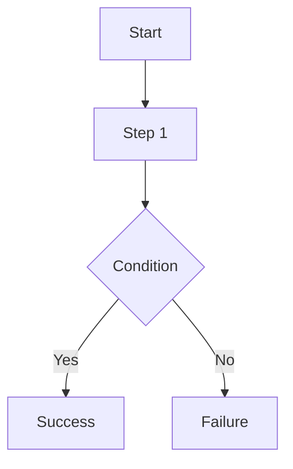

# Use Case Document Template

## 1. Introduction
### 1.1.1. Scope:
[Define the scope of this use case]

### 1.1.2. Objective:
[Primary goal of the actor]

### 1.1.3. Actors:
[List actors, e.g., Candidate, Recruiter, System]

## 2. Business Requirements
### 2.1.1. User Needs and Goals:
[What the user is trying to achieve]

### 2.1.2. Business Needs and Goals:
[How this adds value to the business/process]

### 2.1.3. Preconditions:
[Required state before starting]

## 3. Process Workflow Diagram

## 4. Use Case
### 4.1.1. Use Case 1: [Use Case Name]
### 4.1.2. Description:
[Brief summary of the flow]

### 4.1.3. Navigation:
[Path in the application to reach this screen]

### 4.1.4. Mock-up:

### 4.1.5. Acceptance Criteria:
- [ ] Criterion 1
- [ ] Criterion 2

### 4.1.6. Accessibility Aspects:
- WCAG 2.1 Level AA Compliance
- Keyboard navigation support
- Screen reader compatibility

### 4.1.7. Compliance:
- GDPR / Data Privacy standard
- Industry-specific regulations

### 4.1.8. Data Security:
- Encrypted data at rest and in transit
- Role-based access control (RBAC)

### 4.1.9. Different Roles and Access:
- Recruiter: Full access to configs
- Candidate: Limited interaction via token

### 4.1.10. Reports:
[Does this use case generate or affect any reports?]

### 4.1.11. Help Guide:
[Brief instruction for the end user]

### 4.1.12. Handling Retrospective vs. New Format:
[How does this align with legacy data or new structures?]

### 4.1.13. Alternatives to Routine Solutions:
[Edge cases or fallback patterns]

### 4.1.14. Global Best Practices Followed:
- Atomic Design Principles
- RESTful API standards
- Token-based stateless authentication

### 4.1.15. Global Organizations with Similar Practices:
- LinkedIn Talent Solutions
- Greenhouse
- Lever

## 5. Mockup Reference
[Additional references to Figma, etc.]

## 6. Software BA Change Order Documentation Self-Verification Checklist
- [ ] 1. Introduction & Objective clear and concise?
- [ ] 2. Actors correctly identified?
- [ ] 3. Preconditions & Post-conditions clearly stated?
- [ ] 4. Main success scenario complete?
- [ ] 5. Extensions (alternative/exception paths) identified?
- [ ] 6. Business rules referenced accurately?
- [ ] 7. Data requirements defined (inputs/outputs)?
- [ ] 8. Performance/Security/Accessibility non-functional requirements addressed?
- [ ] 9. Sign-off received from necessary stakeholders?

## 7. Sign-Off Decision
| Role | Decision | Date |
|------|----------|------|
| Product Owner | Pending | |
| Lead Developer | Pending | |
| QA Engineer | Pending | |

## 8. Consents and approval from various stakeholders at various stages
[Record of approvals]

## 9. Test Cases
### 9.1.1. Test Cases
| ID | Title | Priority | Step | Expected Result |
|----|-------|----------|------|-----------------|
| TC1 | Verify... | High | ... | ... |

## 10. Technical Details
- API Endpoint: `POST /api/...`
- Service: `...Service`
- Database: `...` tables
