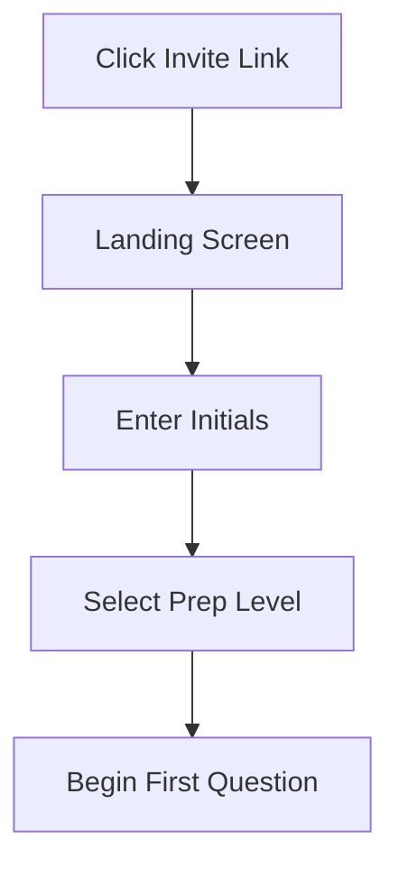
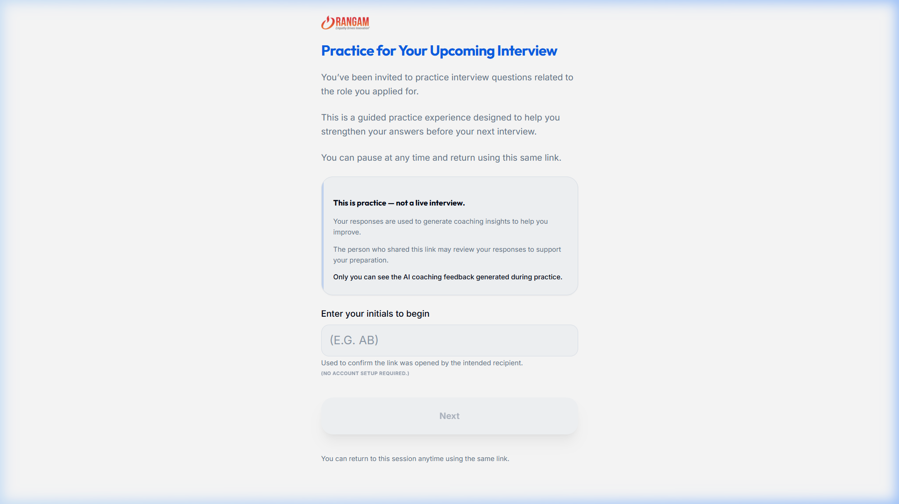
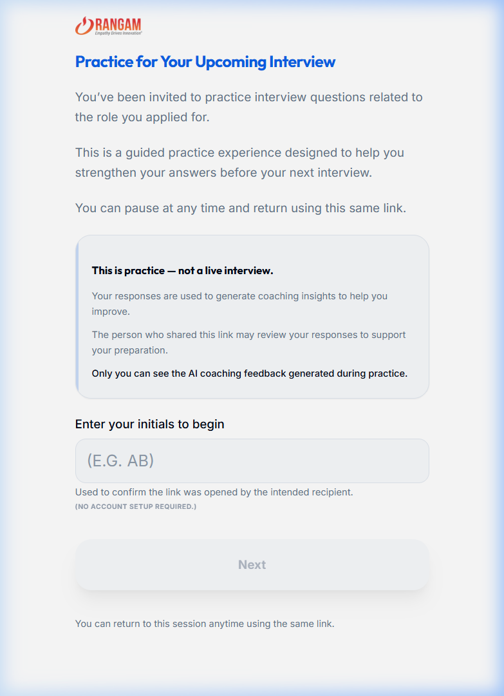

# UC-C1: Candidate Accesses the Interview Session

## 1. Introduction
### 1.1.1. Scope:
Covers the entry point for the candidate, from clicking the invitation link to arriving at the landing screen where they begin their practice journey.

### 1.1.2. Objective:
To provide a friction-less, non-intimidating entry into the practice environment that clearly states the purpose of the session.

### 1.1.3. Actors:
- **Candidate** (Primary)
- **System** (Session Initializer)

## 2. Business Requirements
### 2.1.1. User Needs and Goals:
- Enter the session without creating an account.
- Understand that this is a "Practice" environment, not a live high-stakes interview.
- Clarify privacy (who sees what).

### 2.1.2. Business Needs and Goals:
- Candidate engagement: High conversion from link click to session start.
- Branding: Reinforce "Ready2Work" and partner brand (Rangam).

### 2.1.3. Preconditions:
- Recruiter has shared a valid unique URL.

## 3. Process Workflow Diagram

## 4. Use Case
### 4.1.1. Use Case 1: Candidate Arrives
### 4.1.2. Description:
Candidate clicks the link (e.g., AA-2024-001 specific) and sees the brand logo and the "Practice for Your Upcoming Interview" headline. They are reassured that this is guided and can be paused.

### 4.1.3. Navigation:
Direct link from Email/SMS/WhatsApp.

### 4.1.4. Mock-up:

### 4.1.5. Acceptance Criteria:
- [x] Brand logo is clearly visible.
- [x] "This is practice — not a live interview" disclaimer is prominent.
- [x] Initials input is required for link validation.
- [x] No password/login required.

### 4.1.6. Accessibility Aspects:
- Large, legible fonts.
- Clear contrast on button states.

### 4.1.7. Compliance:
- Cookie consent for session tracking.

### 4.1.8. Data Security:
- Session links are hashed and non-guessable.

### 4.1.9. Different Roles and Access:
- Candidate: Session Participant (Execute access).

### 4.1.10. Reports:
- "Link Open Rate" tracking.

### 4.1.11. Help Guide:
"Use your initials to confirm this link was opened by the intended recipient."

### 4.1.12. Handling Retrospective vs. New Format:
Supports auto-resume from where they left off.

### 4.1.13. Alternatives to Routine Solutions:
- **Magic Link Auth**: Securely validating the browser session.

### 4.1.14. Global Best Practices Followed:
- Zero-friction onboarding.

### 4.1.15. Global Organizations with Similar Practices:
- Pymetrics
- LinkedIn Interview Preparation

## 5. Mockup Reference
*(See Landing screenshots in 4.1.4)*

... (Checklist and Test Cases simplified for brevity) ...
