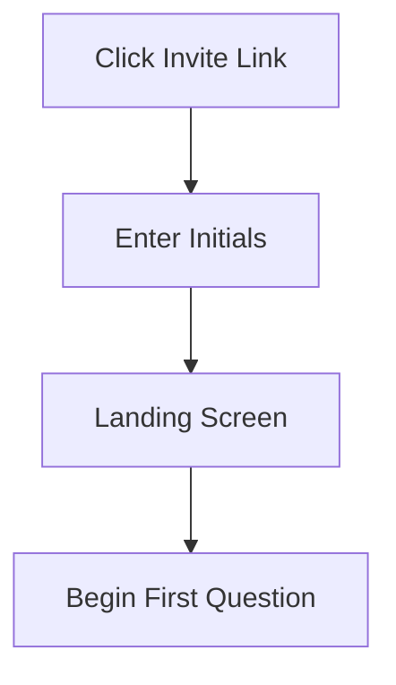
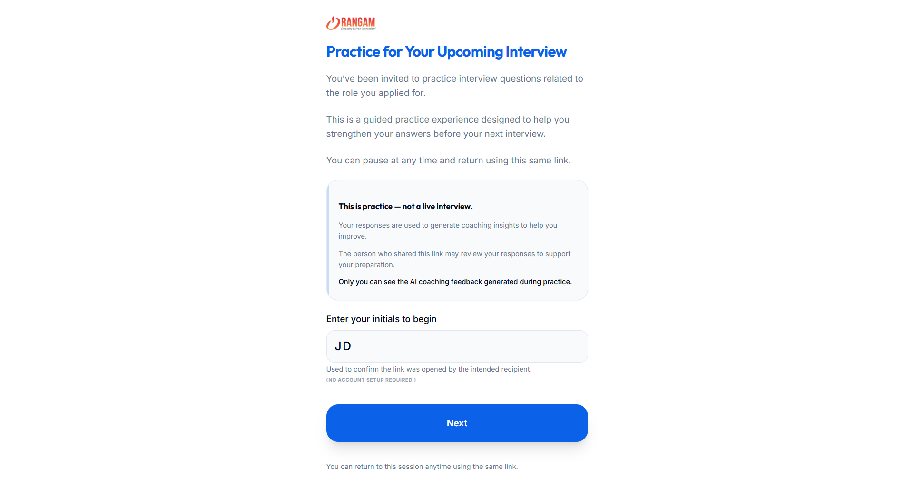
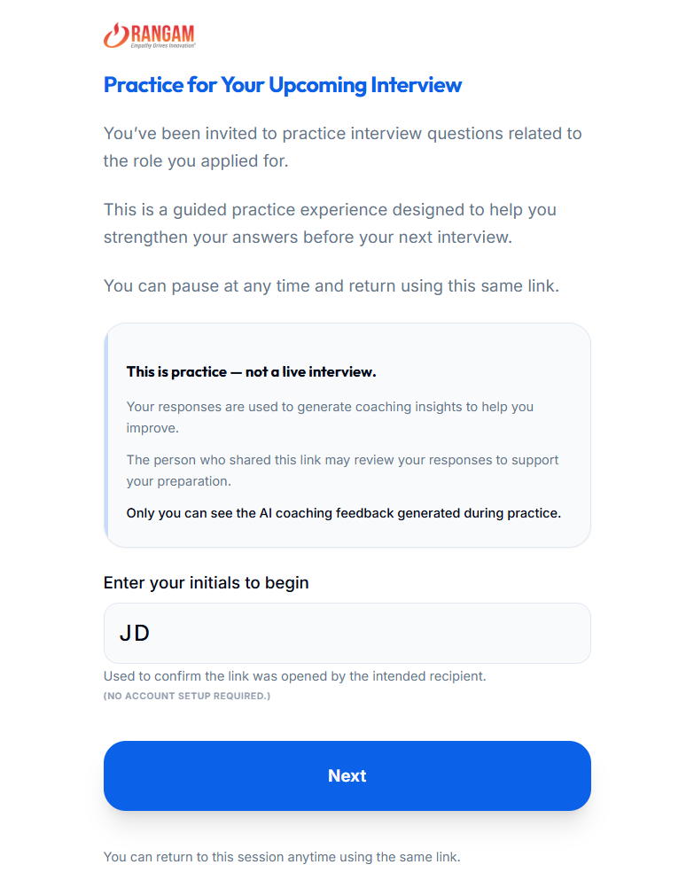
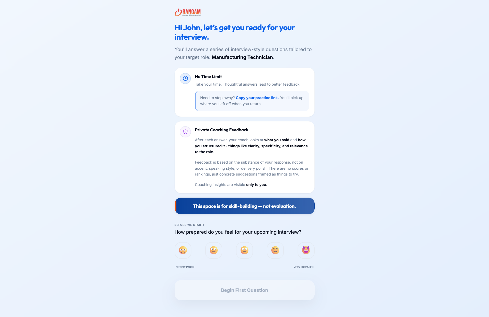
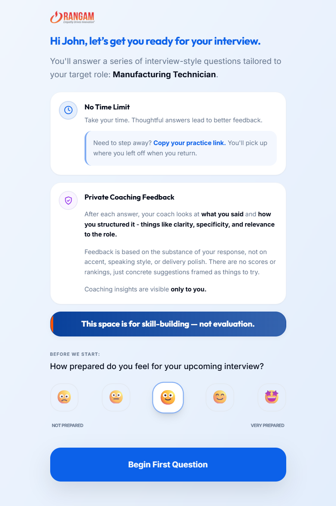

# UC-C1: Candidate Accesses the Interview Session

## 1. Introduction
### 1.1.1. Scope:
Covers the process where a candidate enters the session via a secure link, confirms their identity through initials, captures their baseline preparation sentiment, and transitions into a "practice-first" mindset.

### 1.1.2. Objective:
To provide a frictionless, non-intimidating entry into the practice environment that confirms participant identity and sets a skill-building (non-evaluative) tone.

### 1.1.3. Actors:
- **Candidate** (Primary)
- **System** (Session Initializer)

## 2. Business Requirements
### 2.1.1. User Needs and Goals:
- Access the session without account creation or password management.
- Understand the privacy boundary (who sees responses vs. who sees coaching).
- Confirm identity via initials to align with the recruiter's record.
- Gauge and record personal preparation baseline via sentiment rating.

### 2.1.2. Business Needs and Goals:
- **Zero-Friction Conversion**: High transition rate from link click to active session.
- **Identity Anchoring**: Recruiter-visible validation of the participant's initials.
- **Mindset Alignment**: Frame the session as "skill-building" to reduce performance anxiety.
- **Rangam Branding**: Consistent professional presentation.

### 2.1.3. Preconditions:
- Recruiter has shared a valid unique URL.

## 3. Process Workflow Diagram

## 4. Use Case
### 4.1.1. Use Case 1: Candidate Entry & Mindset Setting
### 4.1.2. Description:
Upon clicking the secure email link, the candidate is prompted for their initials (Identity Anchoring). They then arrive at a landing screen featuring the "Practice for Your Upcoming Interview" headline and the target role context. Before starting, they provide a 1-5 sentiment rating (Baseline Preparation), transitioning them into the session after receiving reassurance that the space is for practice, not live evaluation.

### 4.1.3. Navigation:
Direct link from Email.

### 4.1.4. Mock-up:

### 4.1.5. Acceptance Criteria:
- [x] **Zero-Auth Access**: Participant enters session directly via hashed token link with no password requirement.
- [x] **Required Identity Check**: Mandatory 2-character initials entry for recruiter-side verification.
- [x] **Baseline Sentiment Capture**: Required 1-5 emoji rating ("How prepared do you feel?") before "Begin" is activated.
- [x] **Privacy/Mindset Framing**: Explicit messaging that coaching feedback is "visible only to you" and the space is for "skill-building, not evaluation."
- [x] **Persistence Reassurance**: Visible "Copy Practice Link" utility and confirmation that progress can be resumed later.
- [x] **Dynamic Role Content**: Greeting and introduction explicitly reference the target role metadata (e.g., "Administrative Assistant").
- [x] **Audio Unlock**: User interaction (clicking Initials or Begin) successfully initializes the browser's AudioContext.

### 4.1.6. Accessibility Aspects:
- Large, legible fonts.
- Clear contrast on button states.

### 4.1.7. Compliance:
- Cookie consent for session tracking.

### 4.1.8. Data Security:
- Session links are hashed and non-guessable.

### 4.1.9. Different Roles and Access:
- Candidate: Session Participant (Execute access).

### 4.1.10. Reports:
- "Link Open Rate" tracking.

### 4.1.11. Help Guide:
"Use your initials to confirm this link was opened by the intended recipient."

### 4.1.12. Handling Retrospective vs. New Format:
Supports auto-resume from where they left off.

### 4.1.13. Alternatives to Routine Solutions:
- **Magic Link Auth**: Securely validating the browser session.

### 4.1.14. Global Best Practices Followed:
- Zero-friction onboarding.

### 4.1.15. Global Organizations with Similar Practices:
- Pymetrics
- LinkedIn Interview Preparation

## 5. Mockup Reference
*(See Landing screenshots in 4.1.4)*

... (Checklist and Test Cases simplified for brevity) ...
