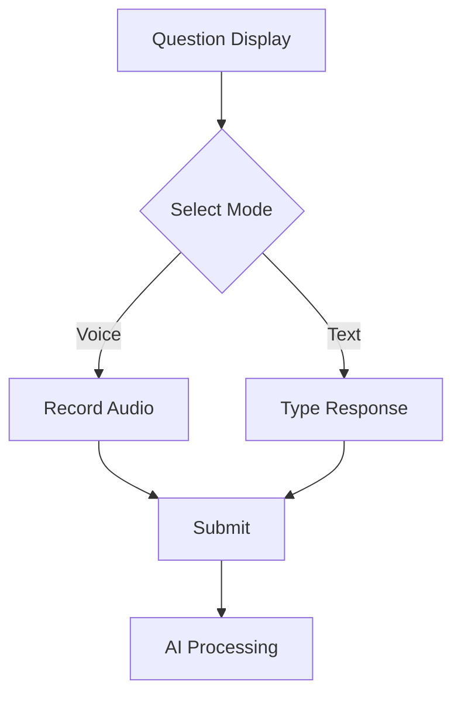
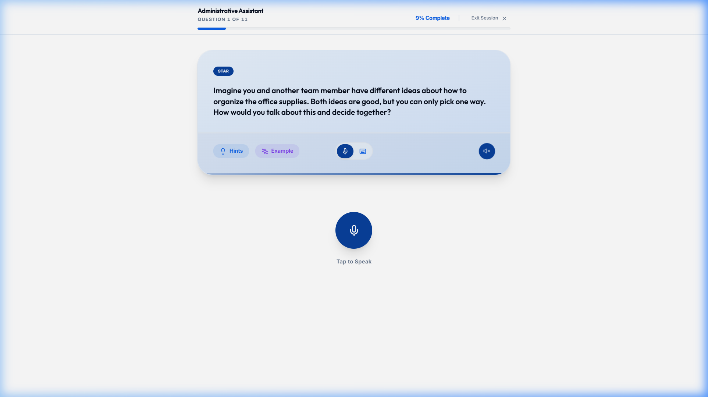
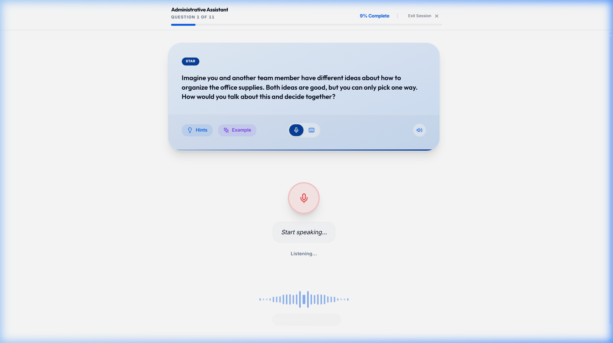
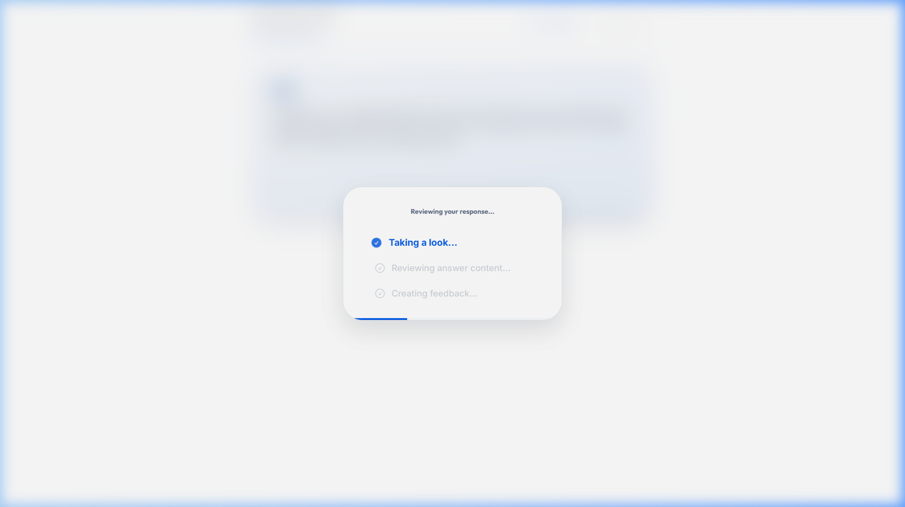

# UC-C2: Candidate Responds to a Question

## 1. Introduction
### 1.1.1. Scope:
The core interaction loop where candidates are presented with a question and provide either a voice or text response.

### 1.1.2. Objective:
To capture candidate responses in a low-pressure environment while providing auxiliary tools like hints and examples.

### 1.1.3. Actors:
- **Candidate** (Primary)
- **STT/Transcription Service** (Secondary)

## 2. Business Requirements
### 2.1.1. User Needs and Goals:
- Toggle between Voice and Text response modes.
- View "Hints" if stuck.
- Securely submit responses.

### 2.1.2. Business Needs and Goals:
- Capture varied response data (audio vs text) for multifaceted AI coaching.

### 2.1.3. Preconditions:
- Candidate has cleared the initials/prep screens.

## 3. Process Workflow Diagram

## 4. Use Case
### 4.1.1. Use Case 1: Candidate Answers Question
### 4.1.2. Description:
Candidate sees a question (e.g., "Imagine you and another team member have different ideas about how to organize office supplies..."). They can use 'Tap to Speak' or the keyboard toggle to respond.

### 4.1.3. Navigation:
Automatic progression through the session.

### 4.1.4. Mock-up:

### 4.1.5. Acceptance Criteria:
- [x] Question text is clear and readable.
- [x] Toggle between Mic and Keyboard works seamlessly.
- [x] Visual feedback provided during recording.

### 4.1.6. Accessibility Aspects:
- Screen readers announce new questions immediately.
- Keyboard navigation supported for all controls.

### 4.1.14. Global Best Practices Followed:
- Progressive disclosure (Hints/Examples hidden by default).

## 5. Mockup Reference

... (Technical details simplified) ...
