# UC-C2: Candidate Responds to a Question

## 1. Introduction
### 1.1.1. Scope:
The interactive core of the session where candidates engage with role-specific questions, leverage auxiliary coaching tools, and receive immediate, segmented AI feedback.

### 1.1.2. Objective:
To provide a low-friction response environment that supports both voice and text modalities while setting clear expectations through real-time feedback and coaching.

### 1.1.3. Actors:
- **Candidate** (Primary)
- **STT/Transcription Service** (Secondary)

## 2. Business Requirements
### 2.1.1. User Needs and Goals:
- Seamlessly switch between Voice (Mic) and Text (Standard Input) response modes.
- Access "Hints" or "Example Responses" (Coach's Lens) to improve answer quality before submission.
- See real-time transcription feedback during voice recording for reassurance.
- Understand AI evaluation status through clear visual masking (Multi-step processing).
- Review segmented feedback (Summary, Delivery, Content) with a "pick up where you left off" persistence.

### 2.1.2. Business Needs and Goals:
- **Multimodal Data Capture**: Collect both audio (if enabled) and text for comprehensive coaching.
- **Engagement Persistence**: Maintain session state across pauses and retries.
- **Sentiment Loop**: Capture "Was this helpful?" feedback to refine the coaching engine.

### 2.1.3. Preconditions:
- Candidate has cleared the initials/prep screens.

## 3. Process Workflow Diagram
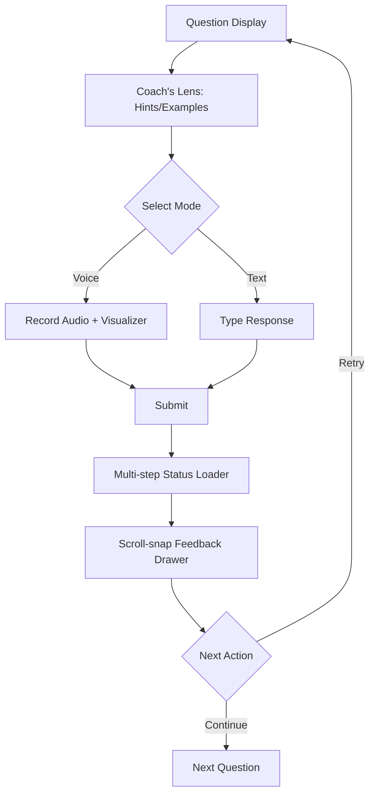

## 4. Use Case
### 4.1.1. Use Case 1: Candidate Engaging with Question & Feedback
### 4.1.2. Description:
Candidate interacts with a role-specific question. They may toggle "Hints" for guidance or "Example" for structure. They record via the mic (with a live visualizer) or type via keyboard. After submission, a masked loader sequence bridges the AI latency before revealing a vertical scroll-snap drawer containing high-level summary, delivery insights (if voice), content analysis with quoted highlights, and a recommended next step (Retry vs. Continue).

### 4.1.3. Navigation:
Automatic progression through the session.

### 4.1.4. Mock-up:
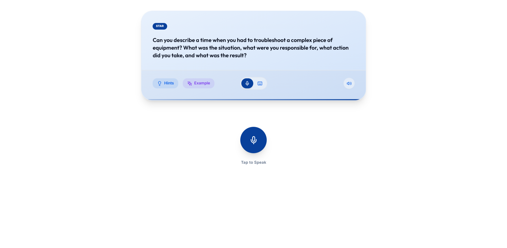
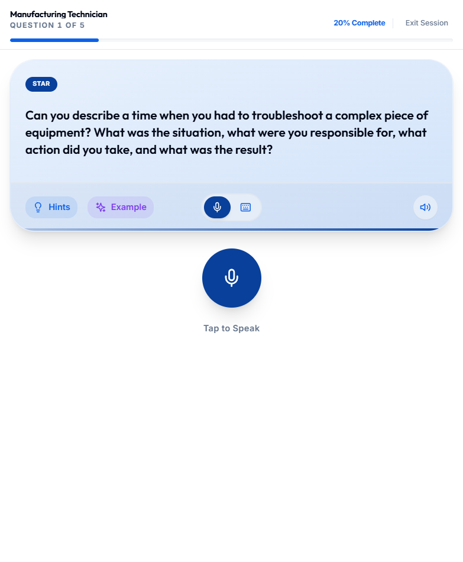
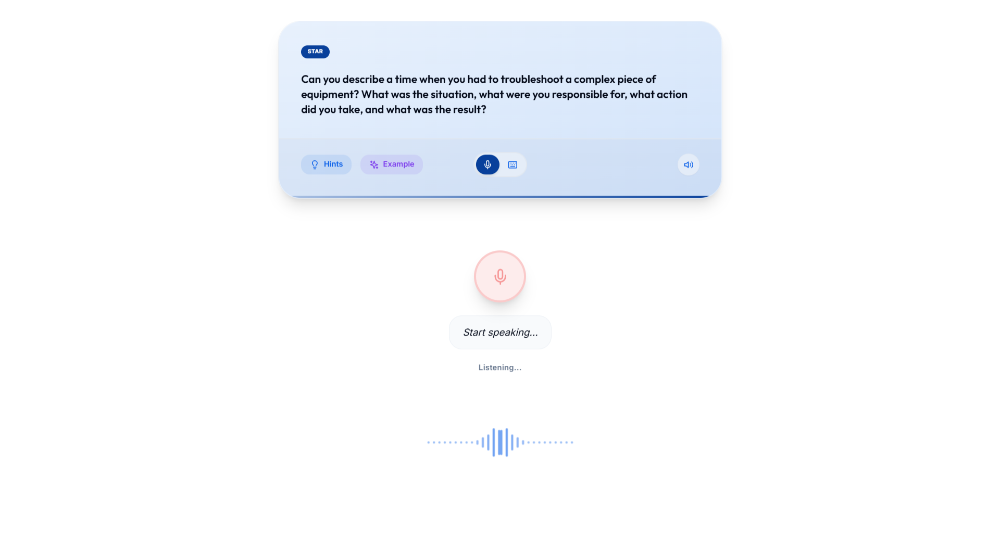
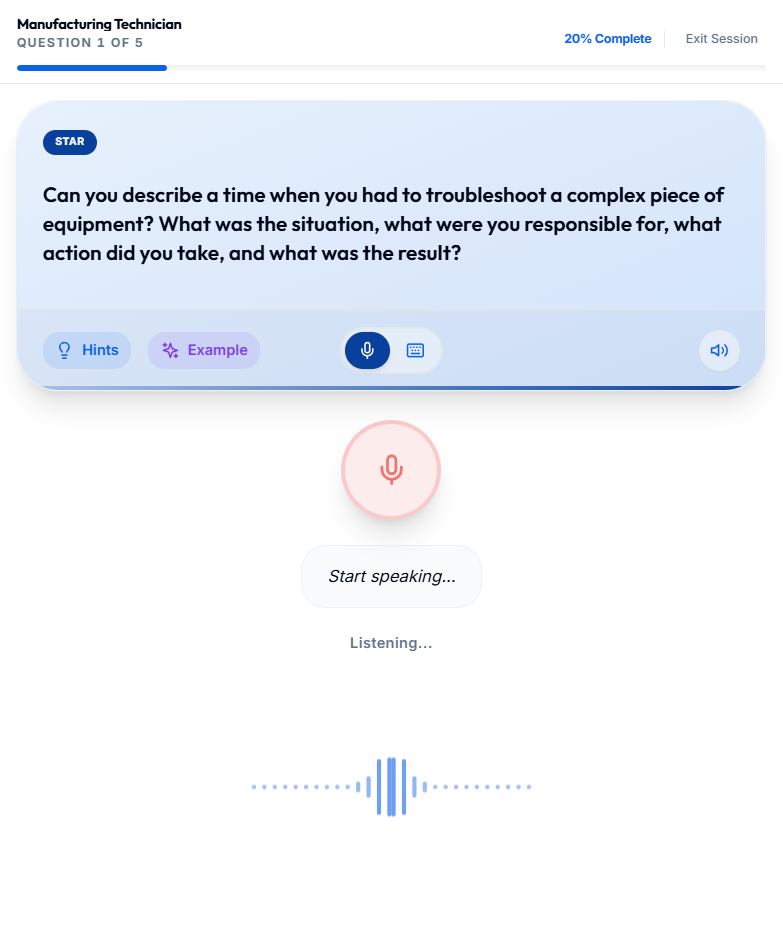
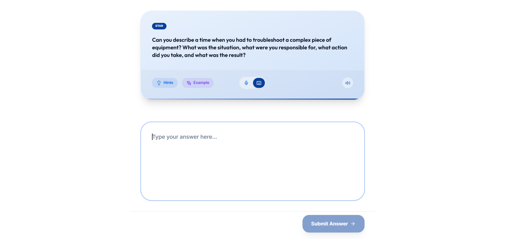
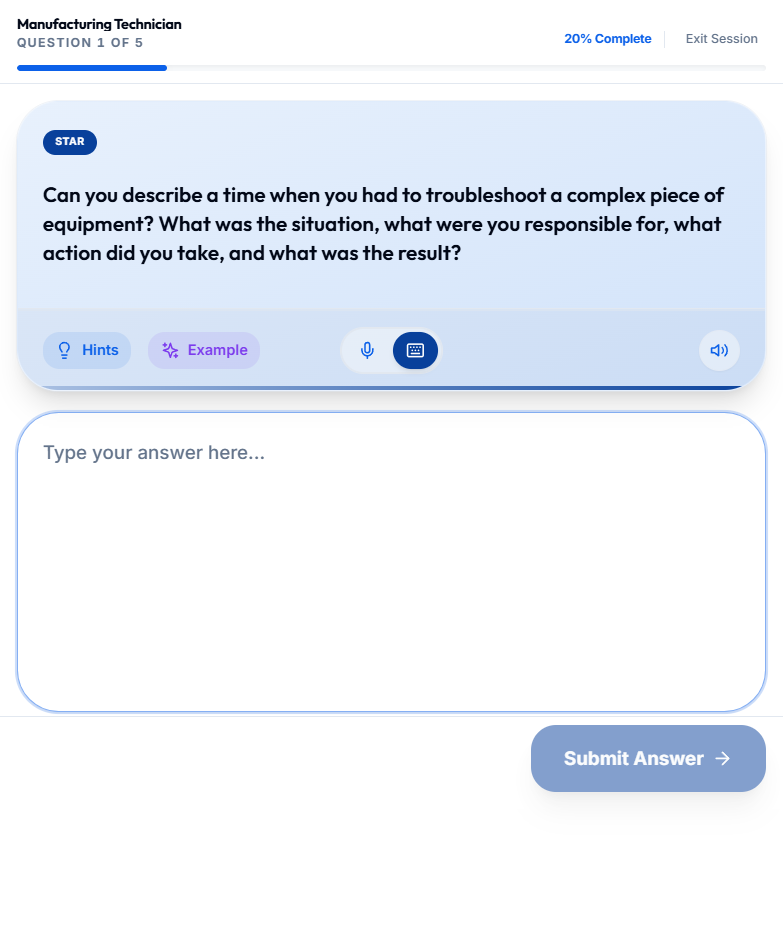
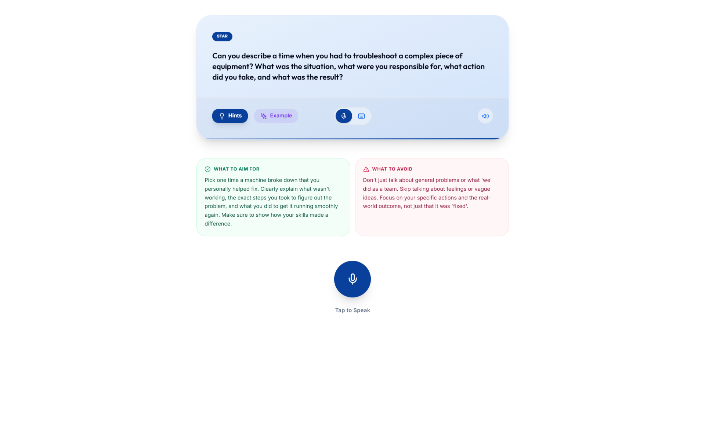
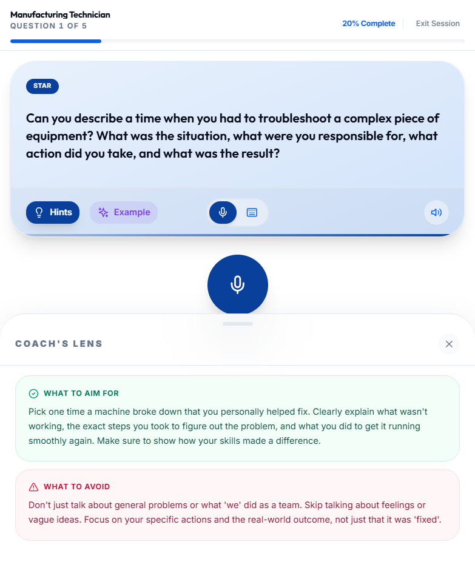
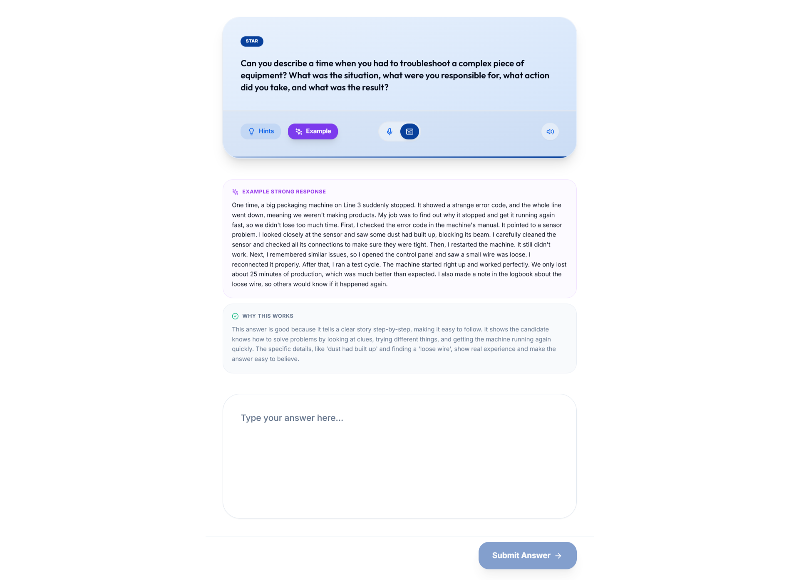
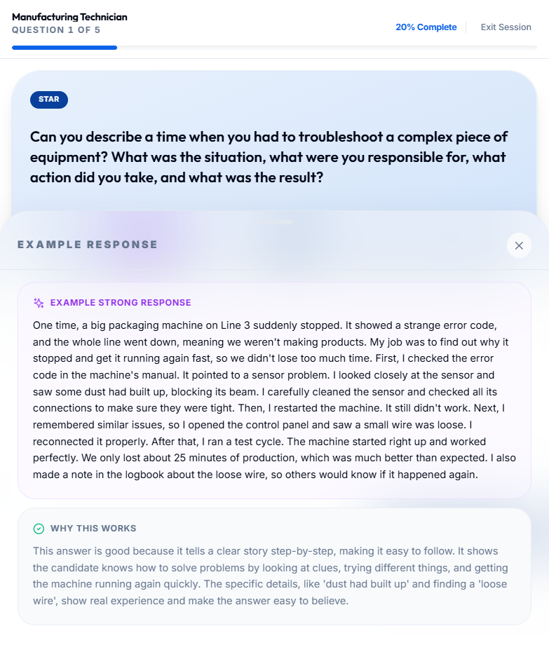

### 4.1.5. Acceptance Criteria:
- [x] **Dual-Mode Input**: Seamless toggle between Voice (Mic + Visualizer) and Text (Standard Input).
- [x] **Coach's Lens**: Auxiliary "Hints" and "Example Responses" are accessible and role-contextualized.
- [x] **Transcription Loop**: Real-time transcript preview during voice recording.
- [x] **Status Masking**: Multi-step loader (e.g., "Noting your speaking delivery...") provides visual feedback during AI processing.
- [x] **Segmented Feedback Drawer**: Scroll-snap overlay displaying Analysis Summary, Delivery Pulse, and Content Pulse.
- [x] **Helpfulness Capture**: Integrated "Was this helpful?" sentiment buttons on feedback cards.
- [x] **Dynamic Context**: Feedback and examples are tailored to the session's target role.
- [x] **Audio Persistence**: Ability to listen back to the recorded response within the feedback transcript panel.
- [x] **Smart Recommendations**: Next steps (Retry vs. Continue) are driven by the AI's `nextAction` metadata.

### 4.1.6. Accessibility Aspects:
- Screen readers announce new questions immediately.
- Keyboard navigation supported for all controls.

### 4.1.14. Global Best Practices Followed:
- Progressive disclosure (Hints/Examples hidden by default).

## 5. Mockup Reference

... (Technical details simplified) ...
