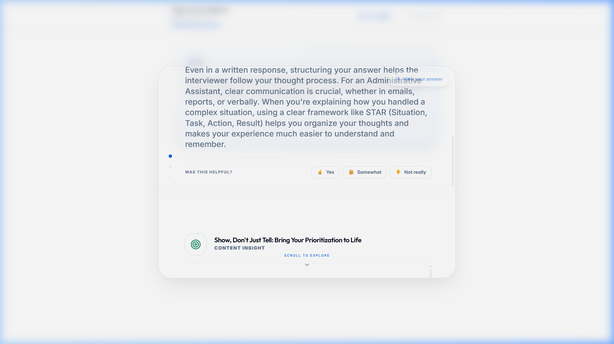
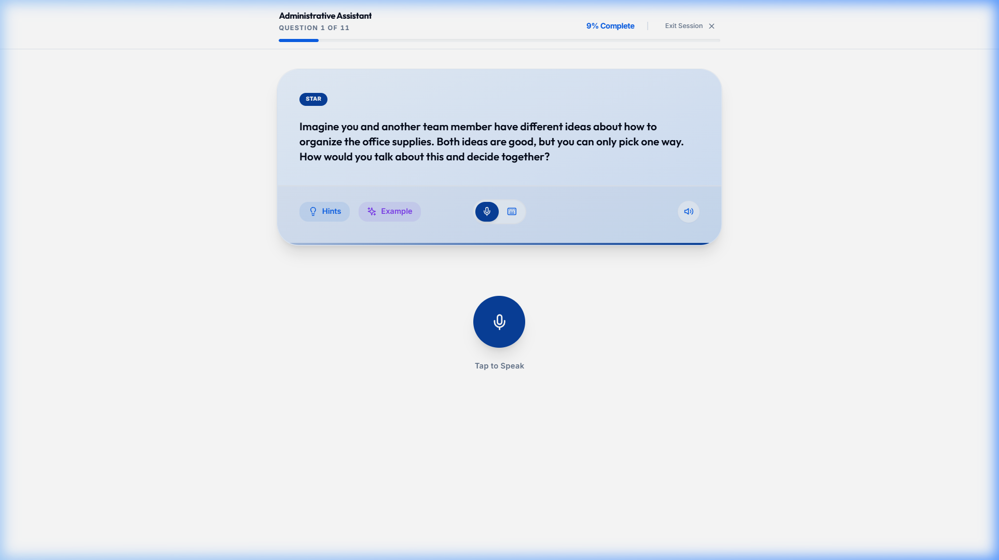

# UC-C4: Candidate Reviews AI Feedback and Retries

## 1. Introduction
### 1.1.1. Scope:
Covers the immediate feedback loop after a question is submitted, where the candidate explores AI insights and decides whether to re-attempt their answer.

### 1.1.2. Objective:
To provide actionable coaching in real-time to help candidates improve their interview delivery and content.

### 1.1.3. Actors:
- **Candidate** (Primary)
- **AI Coach** (Secondary)

## 2. Business Requirements
### 2.1.1. User Needs and Goals:
- Understand high-level performance ("Was this helpful?").
- Deep dive into "Content Insights" and "Delivery Metrics."
- Clear instructions on how to "Retry" to apply feedback.

### 2.1.2. Business Needs and Goals:
- Iterative learning: Encouraging candidates to practice multiple times.

### 2.1.3. Preconditions:
- Response has been submitted and AI feedback generated.

## 4. Use Case
### 4.1.1. Use Case 1: Candidate Explores Feedback
### 4.1.2. Description:
Candidate clicks "Explore Feedback" and sees a scrollable view with insights like "Show, Don't Just Tell." They then click "Retry My Answer" to try again.

### 4.1.4. Mock-up:

### 4.1.5. Acceptance Criteria:
- [x] Feedback is divided into actionable blocks.
- [x] Retry button restores question context.
- [x] "Was this helpful?" sentiment capture is present.

...
