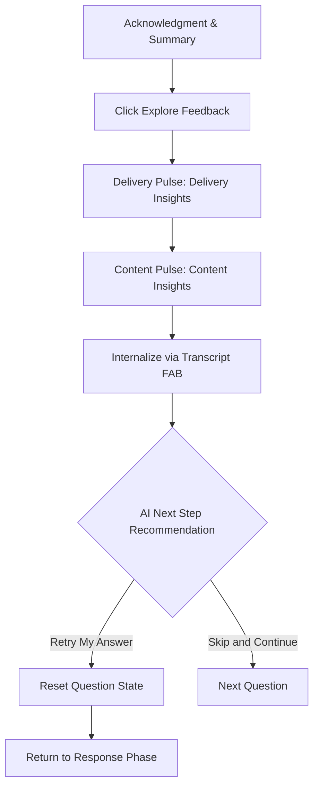
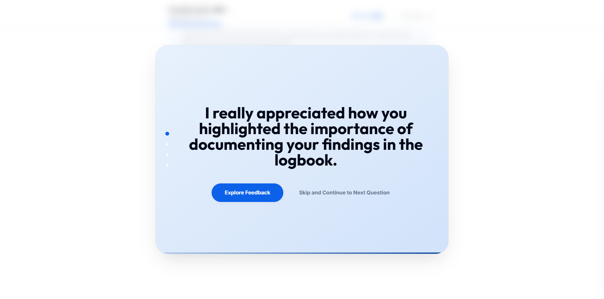
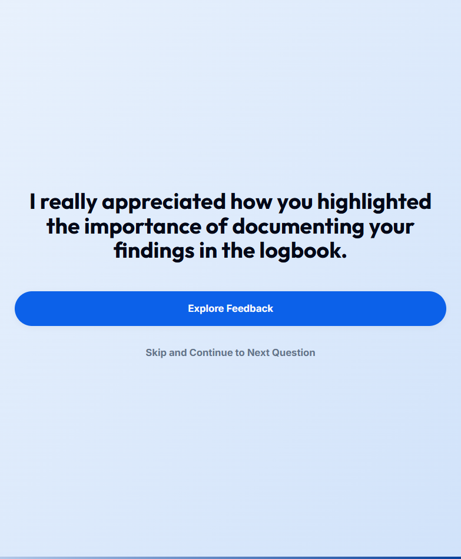
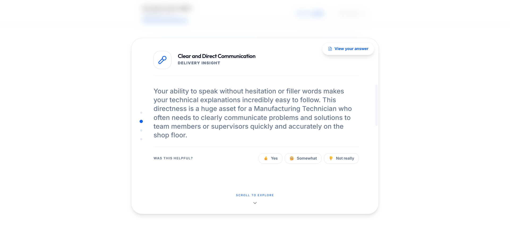
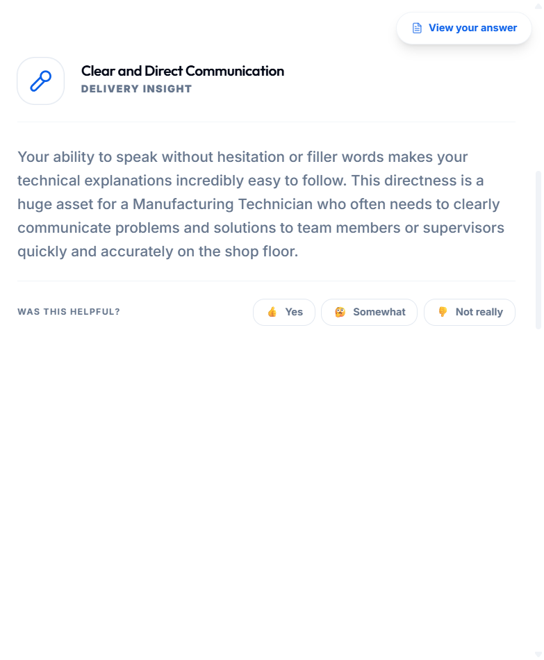
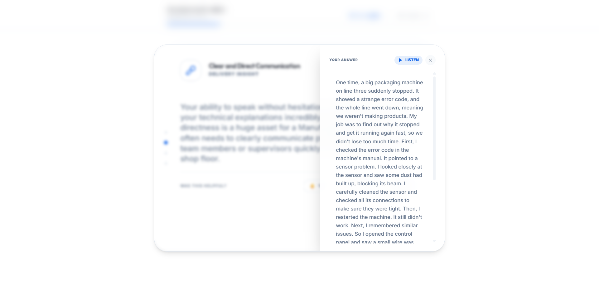
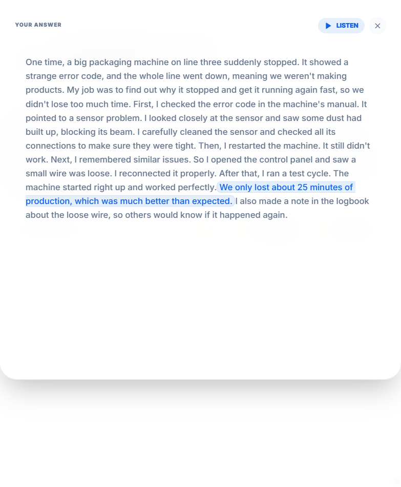
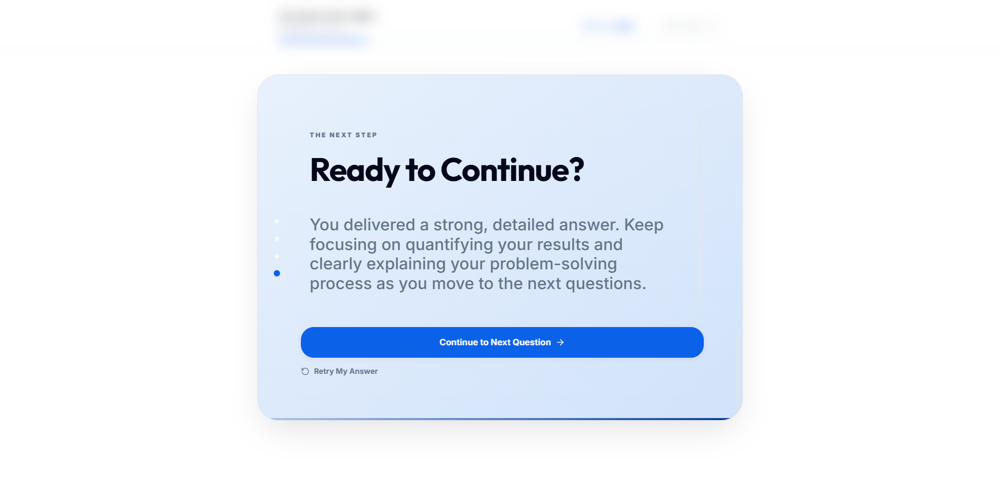
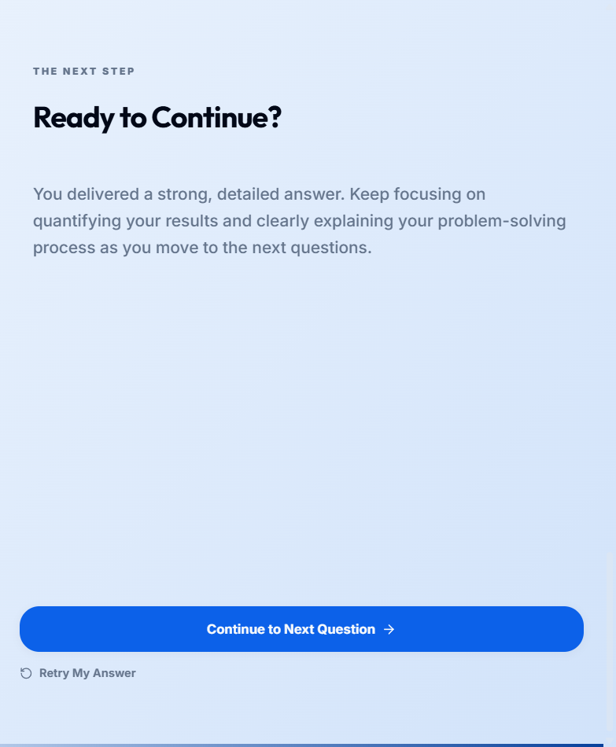

# UC-C4: Candidate Reviews AI Feedback and Retries

## 1. Introduction
### 1.1.1. Scope:
The iterative learning phase of the session where candidates internalize AI-driven coaching insights and decide whether to re-attempt their response to apply those learnings.

### 1.1.2. Objective:
To provide a structured, non-evaluative review experience that transforms raw AI analysis into actionable behavioral improvements through immediate practice.

### 1.1.3. Actors:
- **Candidate** (Primary)
- **AI Coach** (Secondary)

## 2. Business Requirements
### 2.1.1. User Needs and Goals:
- Explore segmented insights (Summary, Delivery, Content) without being overwhelmed.
- See factual evidence (quoted highlights from their own transcript) for AI observations.
- Receive a clear, personalized recommendation on whether a "Retry" is beneficial.
- Capture the "Aha!" moment by immediately applying feedback via a reset response state.
- Measure the helpfulness of specific coaching dimensions.

### 2.1.2. Business Needs and Goals:
- **Loop Closed**: Higher "Retry" rates correlate with deeper candidate internalization of coaching.
- **Sentiment-Driven Optimization**: Collect granular helpfulness data (thumbs up/down or 1-5 rating) on specific coaching dimensions to tune the AI model.
- **Skill Baseline Improvement**: Document candidate progression through iterative attempts.

### 2.1.3. Preconditions:
- Candidate has submitted a response and has arrived at the high-level Analysis Summary card.

## 3. Process Workflow Diagram

## 4. Use Case
### 4.1.1. Use Case 1: Candidate Explores & Contextualizes Feedback
### 4.1.2. Description:
After submitting, the candidate sees an acknowledgment summary. They click "Explore Feedback" to enter a vertical scroll-snap drawer. They transition through segmented insights (e.g., "Show, Don't Just Tell"). For each insight, candidates are prompted with "Was this helpful?", providing immediate sentiment data. They use the floating "View your answer" FAB to cross-reference the AI's quotes with their full transcript. Based on the AI's recommendation (e.g., "Let's try again to ensure your expertise shines through"), they decide to "Retry My Answer," which resets the recording/text input for that specific question.

### 4.1.4. Mock-up:

### 4.1.5. Acceptance Criteria:
- [x] **Engagement Gateway**: Detailed insights (Delivery/Content) are hidden until the candidate clicks "Explore Feedback."
- [x] **Segmented Scroll-Snap**: Feedback is organized into discrete, full-screen cards (Summary, Delivery, Content, Next Step).
- [x] **Identity Verification Badge**: (Reserved for Recruiter Review) Factual transcript matching is available for verification.
- [x] **Internalization Support**: Floating "View your answer" FAB provides access to the full transcript with highlighted coaching quotes.
- [x] **Audio Playback**: Candidates can listen to their previous recording from within the transcript panel.
- [x] **Proactive AI Recommendations**: The "Next" card provides a dynamic recommendation (Retry vs. Continue) based on `nextAction` metadata.
- [x] **State Reset (Retry)**: Clicking "Retry My Answer" clears the current answer's `submittedAt` and resets the interaction mode.
- [x] **Sentiment Capture**: "Was this helpful?" buttons are present on each specific coaching dimension (Delivery/Content).
- [x] **Progress Indicators**: Navigation dots provide visual context of their location within the feedback deep-dive.

### 4.1.6. Accessibility Aspects:
- [x] **Screen Reader Support**: Analysis results and feedback insights are announced sequentially using standard heading hierarchies.
- [x] **Keyboard Navigation**: The scroll-snap feedback drawer supports full keyboard navigation (Arrows/Space) to transition between pulse cards.
- [x] **Visual Contrast**: Coaching quotes and highlighting meet WCAG AA contrast standards for readability.
- [x] **Descriptive Alt-Text**: All visual progress indicators (MultiStepLoader) and visualization icons have descriptive ARIA labels.

### 4.1.7. Compliance:
- [x] **ADR-011 (Privacy-First)**: Coaching data is logically isolated from recruiter views.
- [x] **GDPR/CCPA**: Data minimization is practiced; only essential feedback tokens are stored.

### 4.1.8. Data Security:
- [x] **Token-Based Access**: Sessions are secured via unique candidate tokens, preventing unauthorized feedback access.
- [x] **Encrypted Persistence**: All transcripts and AI analysis are encrypted at rest in Supabase.

### 4.1.9. Different Roles and Access:
- **Candidate**: Full access to personal feedback pulses and retry functionality.
- **Recruiter**: Restricted access; can only see high-level session progress and factual metadata, no coaching insights.

### 4.1.10. Reports:
- **Helpfulness Metric**: Aggregated (anonymized) sentiment data is used for internal AI performance reports.

### 4.1.11. Help Guide:
- Feedback is intended for self-reflection. Use the "Retry" button to practice delivery and content adjustments in a safe, evaluative-free environment.

### 4.1.12. Handling Retrospective vs. New Format:
- [x] Modern horizontal "Pulse" cards replace legacy linear-scroll lists.

### 4.1.13. Alternatives to Routine Solutions:
- **Limited Connectivity**: Transcription is performed server-side to ensure accuracy even on low-powered devices.

### 4.1.14. Global Best Practices Followed:
- Atomic Design Principles for feedback cards.
- Framer Motion for high-fidelity transitions.

### 4.1.15. Global Organizations with Similar Practices:
- LinkedIn Talent Coaching.
- Greenhouse Interview Prep.

---

## 5. Mockup Reference
Detailed UI specs available in Figma under "Candidate Feedback Pulse."

## 6. Software BA Change Order Documentation Self-Verification Checklist
- [x] 1. Introduction & Objective clear and concise?
- [x] 2. Actors correctly identified?
- [x] 3. Preconditions & Post-conditions clearly stated?
- [x] 4. Main success scenario complete?
- [x] 5. Extensions (alternative/exception paths) identified?
- [x] 6. Business rules referenced accurately?
- [x] 7. Data requirements defined (inputs/outputs)?
- [x] 8. Performance/Security/Accessibility non-functional requirements addressed?

## 7. Sign-Off Decision
| Role | Decision | Date |
|------|----------|------|
| Product Owner | Approved | 2026-03-11 |
| Lead Developer | Approved | 2026-03-11 |

## 8. Consents and approval from various stakeholders at various stages
- [x] ADR-011 signed off as primary privacy architect.

## 9. Test Cases
### 9.1.1. Test Cases
| ID | Title | Priority | Step | Expected Result |
|----|-------|----------|------|-----------------|
| TC1 | Verify Retry Flow | High | Click Retry | UI resets to response mode, answer data cleared. |
| TC2 | Verify Exploration Gateway | Med | Submit answer | Detailed insights hidden until "Explore" clicked. |

## 10. Technical Details
- **Context Provider**: `SessionContext`
- **Hook**: `useDomainSession`
- **Supabase Table**: `interview_sessions` (analysis field)
