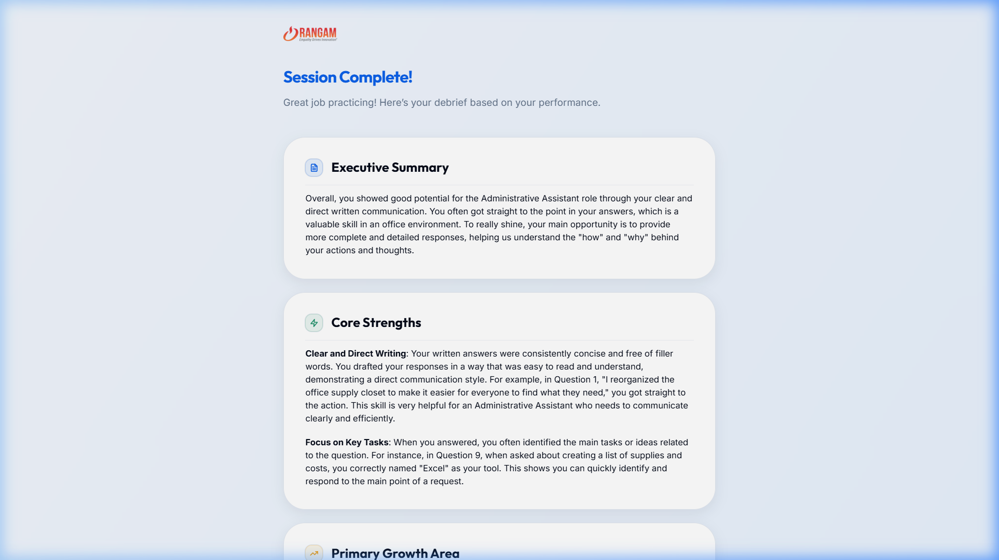
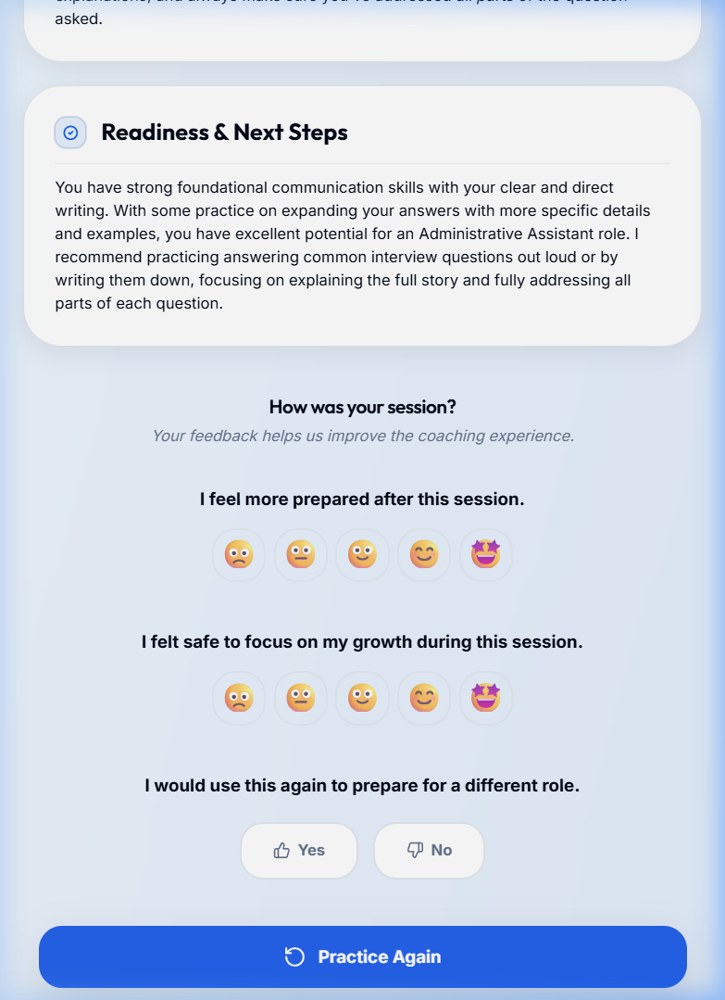

# UC-C5: Candidate Views Session Summary and Concludes

## 1. Introduction
### 1.1.1. Scope:
The final wrap-up phase where the candidate sees their aggregated performance across the entire session.

### 1.1.2. Objective:
To provide a satisfying conclusion and a clear path for further practice.

### 1.1.3. Actors:
- **Candidate** (Primary)
- **System** (Session Finalizer)

## 2. Business Requirements
### 2.1.1. User Needs and Goals:
- View an "Executive Summary" of the entire session.
- Identify "Core Strengths" and "Growth Areas."
- Option to "Practice Again" for another role or the same one.

## 4. Use Case
### 4.1.1. Use Case 1: Session Summary
### 4.1.2. Description:
After the final question, the candidate lands on the "Session Complete!" screen. They see AI-generated cards summarizing their readiness for the Administrative Assistant role.

### 4.1.4. Mock-up:

### 4.1.5. Acceptance Criteria:
- [x] "Session Complete!" headline is clear.
- [x] AI Executive Summary matches actual session performance.
- [x] "Practice Again" button is functional and restarts the flow.
- [x] Recruitment satisfaction survey is present.

...
