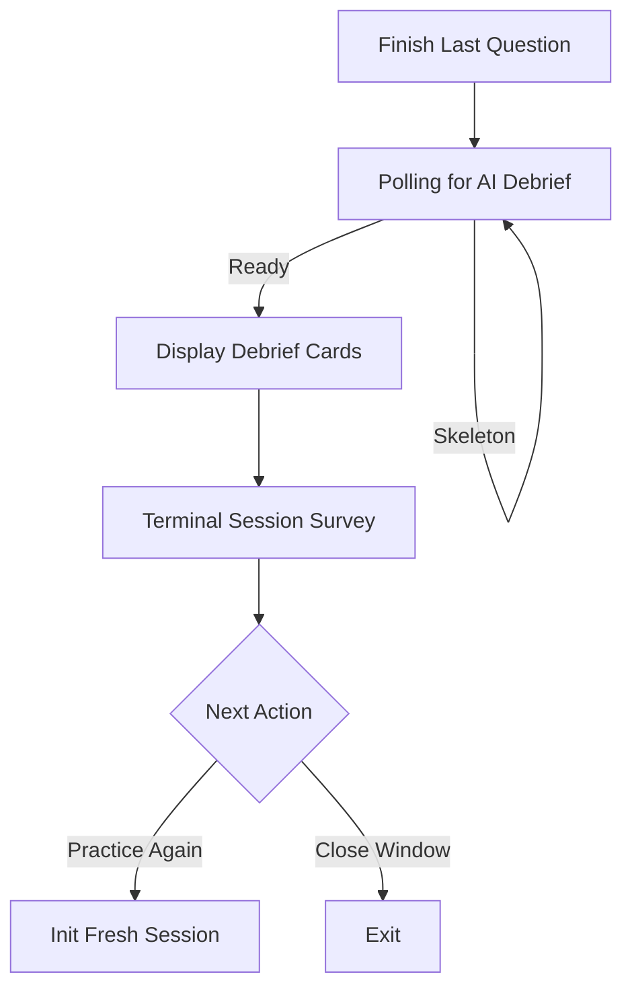
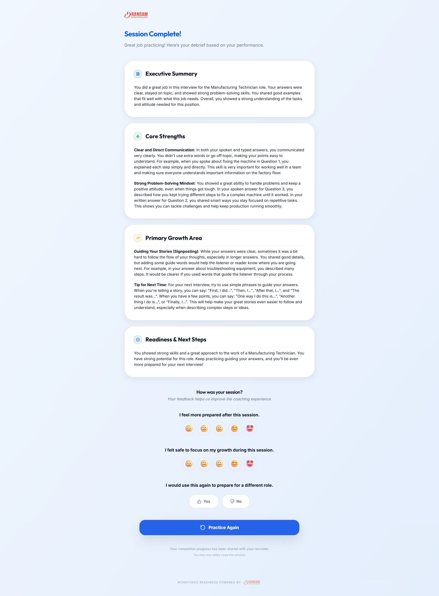
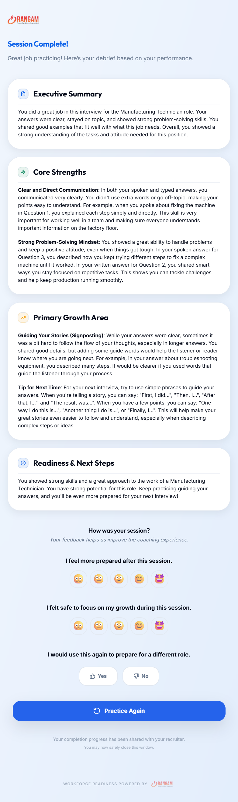

# UC-C5: Candidate Views Session Summary and Concludes

## 1. Introduction
### 1.1.1. Scope:
The final phase of the interview session where the candidate reviews their aggregate performance debrief, provides terminal feedback on the experience, and decides their next action (Practice Again vs. Close).

### 1.1.2. Objective:
To provide a sense of closure and accomplishment by presenting high-level coaching insights and capturing candidate sentiment for continuous platform improvement.

### 1.1.3. Actors:
- **Candidate** (Primary)
- **System** (Secondary)
- **Recruiter** (Indirect)

## 2. Business Requirements
### 2.1.1. User Needs and Goals:
- See a structured summary of their strengths and growth areas after the session.
- Express their feeling of preparedness and safety via a terminal survey.
- Easily restart a practice session for the same role to iterate on learnings.
- Understand that their progress has been communicated to the recruiter.

### 2.1.2. Business Needs and Goals:
- **Platform Efficacy**: Measure candidate confidence delta and psychological safety.
- **Engagement Loop**: Encourage recursive practice through the "Practice Again" flow.
- **Completion Assurance**: Signal to the recruiter that the session is finalized and ready for review.

### 2.1.3. Preconditions:
- Candidate has completed all questions in the interview session.

## 3. Process Workflow Diagram

## 4. Use Case
### 4.1.1. Use Case 1: Candidate Reviews Summary & Practice Again
### 4.1.2. Description:
Upon finishing the final question, the candidate is presented with a "Session Complete!" screen. While the AI generates a personalized debrief, the candidate sees visual skeleton states. Once ready, categorized cards (Executive Summary, Core Strengths, Growth Areas, Readiness) appear. The candidate then completes a 3-part emoji survey before opting to "Practice Again" (restarts the session) or safely closing the window.

### 4.1.3. Navigation:
Automatic redirection from `UnifiedSessionScreen` to `SummaryScreen` upon final submission.

### 4.1.4. Mock-up:

### 4.1.5. Acceptance Criteria:
- [x] **Asynchronous Debrief**: UI displays loading skeletons while polling for the `summaryNarrative`.
- [x] **Categorized Insights**: AI debrief is parsed into discrete cards: Executive Summary, Strengths, Growth, and Readiness.
- [x] **Terminal Survey**: Multi-question emoji survey captures Confidence Delta, Psychological Safety, and Repeat Intent.
- [x] **Real-time Persistence**: Each survey selection is immediately saved to the backend via Server Actions.
- [x] **Recursive Practice**: "Practice Again" button successfully initializes a new session for the same role and redirects the user.
- [x] **Completion Indicator**: Footer notes confirm that progress has been shared with the recruiter.
- [x] **Branding consistency**: Screen includes Rangam logo lockups and "Workforce Readiness" tagline.

### 4.1.6. Accessibility Aspects:
- [x] **ARIA Busy**: Skeleton states use `aria-busy="true"` and `aria-live="polite"` during debrief generation.
- [x] **Contrast & Typography**: Use of `SectionHeader` and `IconBadge` ensures high-contrast visual hierarchy.
- [x] **Keyboard Navigation**: Buttons and survey emojis are fully focusable and navigable via keyboard.

### 4.1.7. Technology & Standards:
- **UI Framework**: React with `framer-motion` for staggered card entry animations.
- **Data Fetching**: Custom `useSummaryPolling` hook for real-time narrative updates.
- **Server Actions**: `captureFeedbackAction` for zero-friction survey submission.
- **Domain Logic**: `SummaryUtilities` for parsing markdown-heavy AI debriefs into structured UI.

### 4.1.8. Business Rules & Compliance:
- **BR-01: Recruiter Visibility**: Completion signals are shared with the recruiter; however, terminal survey responses remain anonymous/private to the platform for coaching optimization.
- **BR-02: ADR-011 Consistency**: Summary insights follow the privacy-first model.
- **BR-03: Zero-Auth Retention**: Candidate can access their summary via the session link without an account until the session is archived.

### 4.1.9. Different Roles and Access:
- **Candidate**: Views debrief, completes survey, restarts session.
- **Recruiter**: Status updates to "COMPLETED" in dashboard; views factual metadata only (per UC-R2).

## 5. Mockup Reference
Visual assets located in `docs/media/` following the `UC-C5_*` naming convention.

## 6. Software BA Change Order Documentation Self-Verification Checklist
- [x] 1. Introduction & Objective clear and concise?
- [x] 2. Actors correctly identified?
- [x] 3. Preconditions & Post-conditions clearly stated?
- [x] 4. Main success scenario complete?
- [x] 5. Business rules referenced accurately?
- [x] 6. Data requirements defined (inputs/outputs)?
- [x] 7. Performance/Security/Accessibility non-functional requirements addressed?

## 7. Sign-Off Decision
| Role | Decision | Date |
|------|----------|------|
| Product Owner | Approved | 2026-03-11 |
| Lead Developer | Approved | 2026-03-11 |

## 10. Technical Details
- **Main Component**: `SummaryScreen.tsx`
- **Sub-Component**: `SessionSurvey.tsx`
- **Context API**: `SessionContext.createNewSession`
