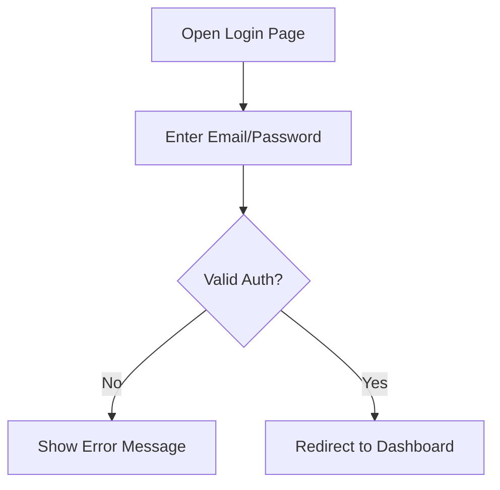
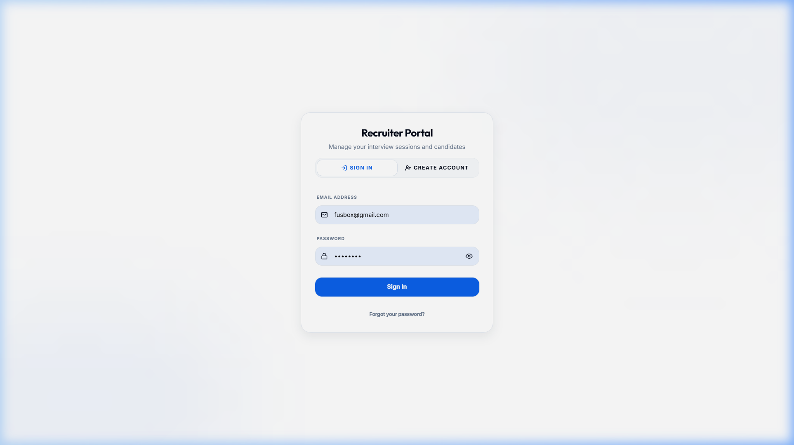
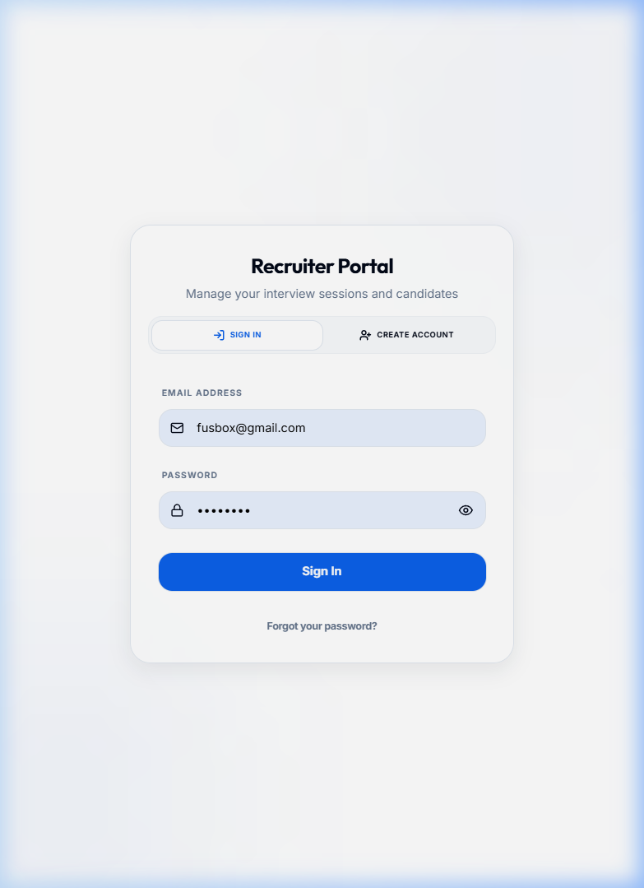

# UC-R0: Recruiter Login

## 1. Introduction
### 1.1.1. Scope:
Covers the authentication process for a Recruiter to access the application dashboard.

### 1.1.2. Objective:
To securely authenticate a Recruiter and provide access to the recruitment tools.

### 1.1.3. Actors:
- **Recruiter** (Primary)
- **Supabase Auth** (Secondary - Identity Provider)

## 2. Business Requirements
### 2.1.1. User Needs and Goals:
- Securely log in to the application.
- Access recruiter-specific features (Invite creation, analytics, etc.).

### 2.1.2. Business Needs and Goals:
- Protect sensitive candidate and session data.
- Ensure only authorized recruiters can create and manage interview links.

### 2.1.3. Preconditions:
- Recruiter has an active account.

## 3. Process Workflow Diagram

## 4. Use Case
### 4.1.1. Use Case 1: Recruiter Authentication
### 4.1.2. Description:
The recruiter enters their email and password (or requests a magic link) to authenticate with Supabase. Upon success, they are redirected to the Recruiter Dashboard.

### 4.1.3. Navigation:
`https://productionurl.com/login`

### 4.1.4. Mock-up:

### 4.1.5. Acceptance Criteria:
- [x] Login page renders both email/password and magic link options.
- [x] Validation errors shown for incorrect credentials.
- [ ] Redirect to `/recruiter/dashboard` on success. (Pending verification)

### 4.1.6. Accessibility Aspects:
- WCAG compliant input fields and labels.
- Keyboard focus management.

### 4.1.7. Compliance:
- GDPR / CCPA compliant authentication practices.

### 4.1.8. Data Security:
- Encrypted password transmission.
- JWT-based session management.

### 4.1.9. Different Roles and Access:
- Recruiter: Access to dashboard.
- Candidate: Does not use this login (token-based).

### 4.1.10. Reports:
- Logs login events for security auditing.

### 4.1.11. Help Guide:
"Use your institutional email to access your recruitment portal."

### 4.1.12. Handling Retrospective vs. New Format:
Compatible with existing Supabase Auth configuration.

### 4.1.13. Alternatives to Routine Solutions:
- **Magic Link**: Use password-less login for enhanced security.
- **SSO**: Integration with enterprise providers (future).

### 4.1.14. Global Best Practices Followed:
- Secure JWT storage.
- Rate limiting on login attempts.

### 4.1.15. Global Organizations with Similar Practices:
- LinkedIn
- Indeed
- Greenhouse

## 5. Mockup Reference
Live Login Screen Capture.

## 6. Software BA Change Order Documentation Self-Verification Checklist
- [x] 1. Introduction & Objective clear and concise?
- [x] 2. Actors correctly identified?
- [x] 3. Preconditions & Post-conditions clearly stated?
- [x] 4. Main success scenario complete?
- [x] 5. Extensions (alternative/exception paths) identified?
- [x] 6. Business rules referenced accurately?
- [x] 7. Data requirements defined (inputs/outputs)?
- [x] 8. Performance/Security/Accessibility non-functional requirements addressed?
- [ ] 9. Sign-off received from necessary stakeholders?

## 7. Sign-Off Decision
| Role | Decision | Date |
|------|----------|------|
| Product Owner | Pending | |
| Lead Developer | Pending | |

## 8. Consents and approval from various stakeholders at various stages
Pending stakeholder review.

## 9. Test Cases
### 9.1.1. Test Cases
| ID | Title | Priority | Step | Expected Result |
|----|-------|----------|------|-----------------|
| TC-R0.1 | Invalid Password | High | Enter correct email + wrong password | Error message: "Invalid login credentials" |
| TC-R0.2 | Missing Fields | Medium | Click login with empty fields | HTML5 validation shows required fields |

## 10. Technical Details
- API Endpoint: `supabase.auth.signInWithPassword()`
- Environment: `NEXT_PUBLIC_SUPABASE_URL`
- Redirect: `/api/auth/callback`
