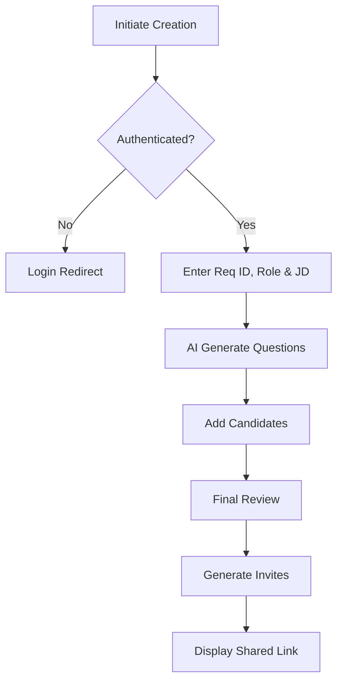
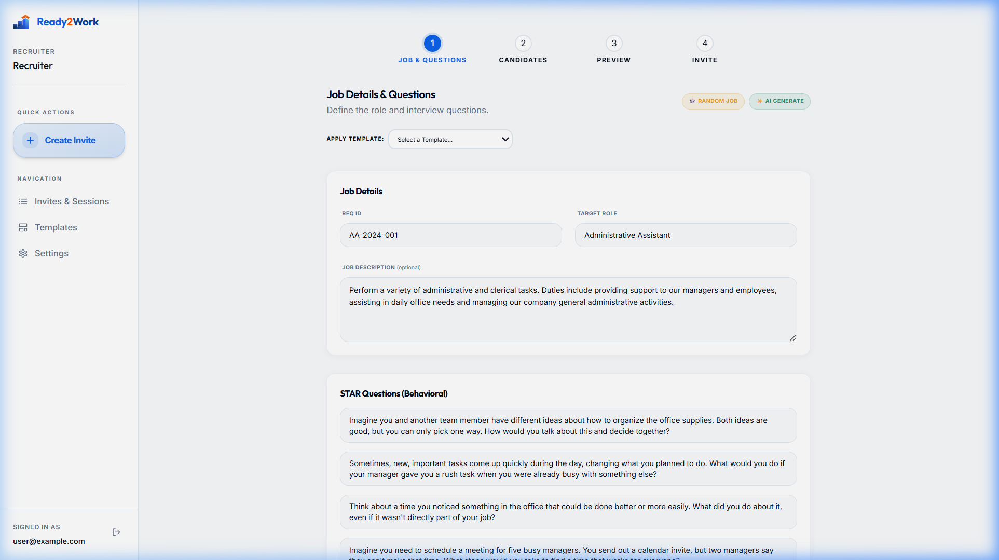
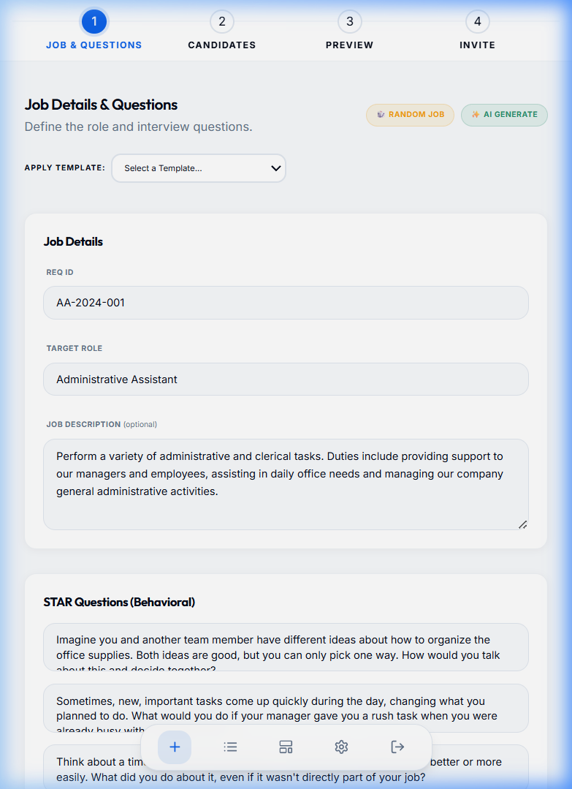
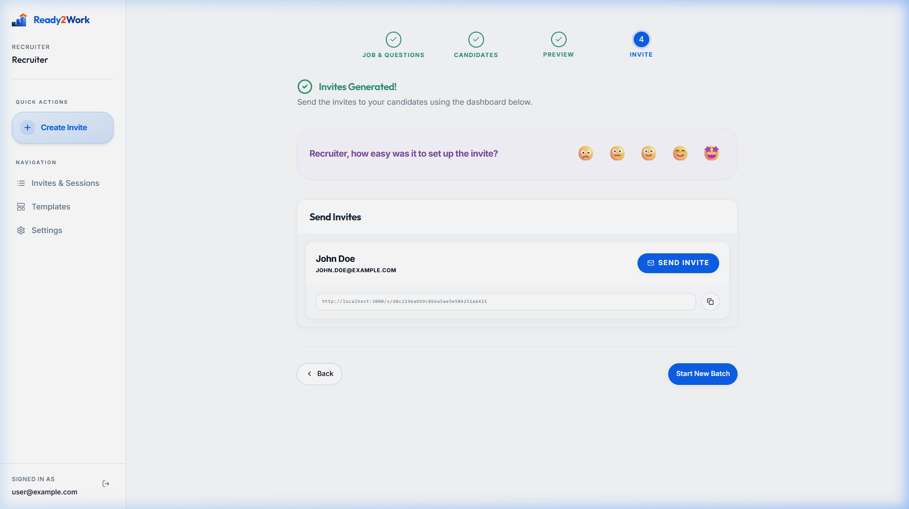

# UC-R1: Recruiter Configures an Interview Session

## 1. Introduction
### 1.1.1. Scope:
Covers the initial setup phase where a Recruiter defines the parameters for a candidate's interview session, including the target role and behavioral questions.

### 1.1.2. Objective:
To generate a candidate-specific session link and prepare the session context (role, job description, intake defaults) while preserving privacy and determinism.

### 1.1.3. Actors:
- **Recruiter** (Primary)
- **System** (Secondary - Session Orchestrator)
- **AI Service** (Secondary - Populates technical and behavioral questions)

## 2. Business Requirements
### 2.1.1. User Needs and Goals:
- Quickly create high-quality interview sessions.
- Tailor questions to specific job descriptions and requisition IDs.
- Securely share links without requiring candidate registration.

### 2.1.2. Business Needs and Goals:
- Standardizing the interview intake process across the organization.
- Reducing time-to-hire through automated session preparation.
- Maintaining a clear audit trail of session configurations via Req IDs.

### 2.1.3. Preconditions:
- Recruiter is authenticated.
- Target role is known (e.g., Administrative Assistant).

## 3. Process Workflow Diagram

## 4. Use Case
### 4.1.1. Use Case 1: Recruiter Configures Session
### 4.1.2. Description:
The recruiter enters the Req ID (e.g., AA-2024-001), target role, and job description. The system uses AI to generate relevant questions. The recruiter then adds candidates and previews the invite before generation.

### 4.1.3. Navigation:
Recruiter Dashboard > "New Invite" Button

### 4.1.4. Mock-up:

### 4.1.5. Acceptance Criteria:
- [x] Recruiter MUST enter a Req ID for tracking.
- [x] System supports Administrative Assistant role context.
- [x] AI Generate correctly populates STAR/Technical questions.
- [x] Multi-step progress bar (Job, Candidates, Preview, Invite) accurately reflects status.

### 4.1.6. Accessibility Aspects:
- WCAG 2.1 Level AA Compliance.
- Form fields labeled with ARIA descriptors.
- Logical tab order through the creation wizard.

### 4.1.7. Compliance:
- GDPR compliant data handling for candidate PII.
- SOC 2 compliance for encrypted invite links.

### 4.1.8. Data Security:
- Requisition data stored in encrypted Postgres tables.
- JWT-based auth used for all recruiter actions.

### 4.1.9. Different Roles and Access:
- Recruiter: Creator/Owner (Edit access).
- Admin: Global oversight.

### 4.1.10. Reports:
- Data feeds into "Hiring Velocity" and "Recruiter Activity" dashboards.

### 4.1.11. Help Guide:
"Ensure the Req ID matches your internal tracking system for seamless integration."

### 4.1.12. Handling Retrospective vs. New Format:
Supports legacy sessions without Req IDs by defaulting to "N/A" for report consistency.

### 4.1.13. Alternatives to Routine Solutions:
- **Bulk Candidate Import**: Uploading a list of candidates to generate multiple links at once.

### 4.1.14. Global Best Practices Followed:
- Atomic Design UI components.
- Idempotent invite generation to prevent duplicate links.

### 4.1.15. Global Organizations with Similar Practices:
- LinkedIn Talent Solutions
- Greenhouse

## 5. Mockup Reference

## 6. Software BA Change Order Documentation Self-Verification Checklist
- [x] 1. Introduction & Objective clear and concise?
- [x] 2. Actors correctly identified?
- [x] 3. Preconditions & Post-conditions clearly stated?
- [x] 4. Main success scenario complete?
- [x] 5. Extensions (alternative/exception paths) identified?
- [x] 6. Business rules referenced accurately?
- [x] 7. Data requirements defined (inputs/outputs)?
- [x] 8. Performance/Security/Accessibility non-functional requirements addressed?
- [ ] 9. Sign-off received from necessary stakeholders?

## 7. Sign-Off Decision
| Role | Decision | Date |
|------|----------|------|
| Product Owner | Pending | |
| Lead Developer | Pending | |

## 8. Consents and approval from various stakeholders at various stages
Pending approval.

## 9. Test Cases
### 9.1.1. Test Cases
| ID | Title | Priority | Step | Expected Result |
|----|-------|----------|------|-----------------|
| TC-R1.1 | Empty Req ID | High | Submit without Req ID | Validation error |
| TC-R1.2 | AI Generation | High | Click AI Generate | questions populated in < 3s |

## 10. Technical Details
- API Endpoint: `POST /api/invites` (Next.js server action)
- Database: `invites`, `invite_questions`
