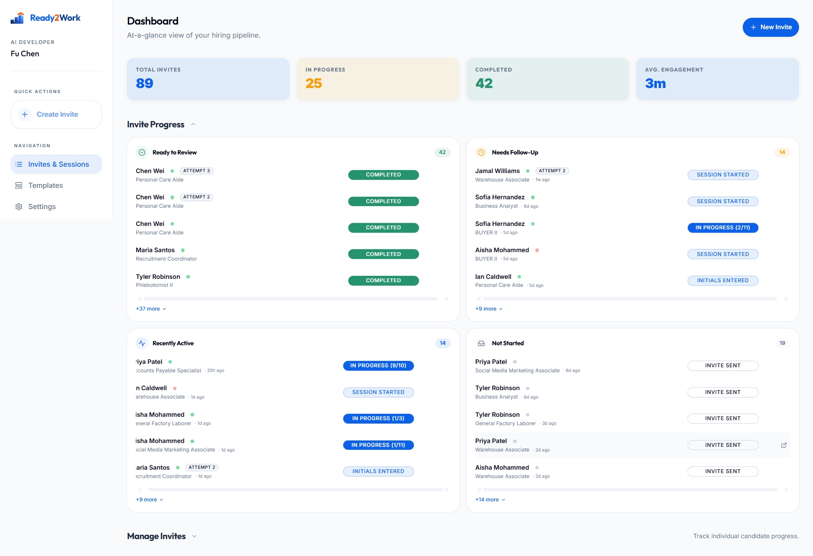
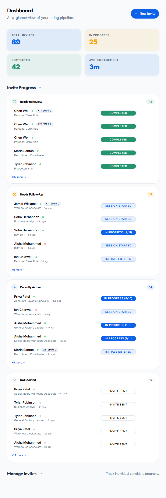
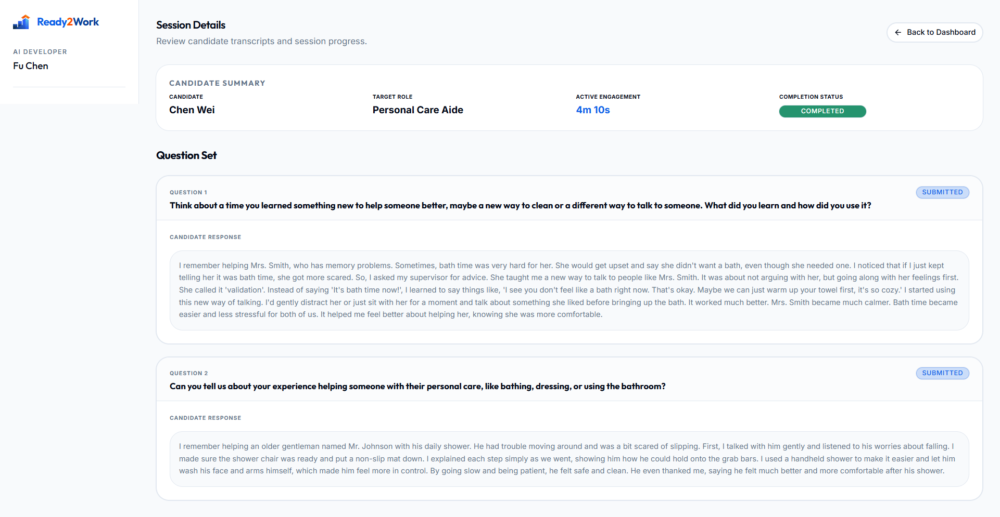
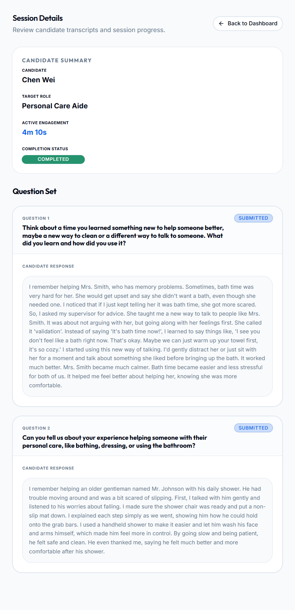

# UC-R2: Recruiter Reviews a Candidate Interview Session

## 1. Introduction
### 1.1.1. Scope:
Covers the process where a Recruiter monitors candidate progress and reviews factual session data (transcripts, engagement telemetry, and identity verification) without access to AI-generated coaching feedback or readiness scores.

### 1.1.2. Objective:
To provide recruiters with an objective, factual record of a candidate's interview session while ensuring compliance with internal privacy constraints (ADR-011).

### 1.1.3. Actors:
- **Recruiter** (Primary)
- **System** (Secondary - Data Orchestration)
- **Identity Provider** (Secondary - Initials Verification)

## 2. Business Requirements
### 2.1.1. User Needs and Goals:
- Monitor real-time progress of sent invitations.
- Access exact textual transcripts of candidate responses.
- Verify candidate identity via initials matching benchmarks.
- Audit active engagement time spent by the candidate.

### 2.1.2. Business Needs and Goals:
- **Compliance (ADR-011)**: Mitigate risk by walling off qualitative AI feedback from internal users.
- **Transparency**: Provide a direct, unmediated record of candidate input for hiring managers.
- **Operational Efficiency**: Centralize invite status and session telemetry in a single dashboard.

### 2.1.3. Preconditions:
- Recruiter is authenticated and owns the session invitation.
- Candidate has accessed the link (status > "Invite Sent").

## 3. Process Workflow Diagram
```mermaid
graph TD
    Start[Recruiter Logs In] --> Dashboard[View Manage Invites Table]
    Dashboard --> Status[Monitor Status/Initials Match]
    Status --> Select[Click Candidate Row]
    Select --> Detail[View Session Details Page]
    Detail --> Transcripts[Review Factual Transcripts]
    Transcripts --> Back to Dashboard[Exit Review]
```

## 4. Use Case
### 4.1.1. Use Case 1: Recruiter Reviews Session Data
### 4.1.2. Description:
The recruiter accesses the dashboard to track candidate activity. They can see 7 distinct progression states (from Invite Sent to Completed) and an identity verification dot (green for match, red for mismatch, gray for pending). Upon selecting a candidate, they review the exact words the candidate spoke or typed for each question, complemented by the total time the candidate remained active in the session workspace.

### 4.1.3. Navigation:
Recruiter Dashboard > "Manage Invites" Section > [Candidate Row]

### 4.1.4. Mock-up:





### 4.1.5. Acceptance Criteria:
- [x] **Factual Traceability**: Real-time status tracking across 7 states (Invite Sent, Link Viewed, Initials Entered, Session Started, Drafting Answer, In Progress, Completed).
- [x] **Identity Verification**: Visual "Initials Match" indicator compares recruiter-entered names with candidate-entered initials. 
  - *Note*: Mismatch does not block candidate access but is flagged for recruiter review.
- [x] **Transcript Accuracy**: Display of full textual transcripts for all submitted answers.
- [x] **Engagement Telemetry**: Tracking and display of "Active Engagement" time (cumulative seconds active in workspace).
- [x] **Privacy Wall (ADR-011)**: Complete exclusion of AI readiness scores, growth summaries, or coaching observations from all recruiter-facing views.
- [x] **Ownership Enforcement**: Recruiters can only access sessions they personally generated.
- [x] **Actionable Lifecycle**: Ability to resend invite emails (mailto) or delete session records directly from the review table.

### 4.1.6. Accessibility Aspects:
- Semantic color tokens (state-info, state-success, state-critical) for high-contrast status badges.
- Screen reader friendly table structures and labels.

### 4.1.7. Compliance:
- **SOC 2**: Encrypted invite tokens and session records.
- **GDPR**: Minimized data visibility in summary dashboard.
- **Internal Risk (ADR-011)**: Qualitative AI "judgement" data is inaccessible to recruiters to avoid liability.

### 4.1.8. Data Security:
- Server-side repository pattern hides sensitive AI columns from recruiter queries.
- JWT-based authorization for all session detail retrieval.

### 4.1.9. Different Roles and Access:
- Recruiter: Factual session data & telemetry.
- Candidate: Full debrief (AI feedback) upon completion (separate flow).

### 4.1.10. Reports:
- Raw transcripts available for download/export (future).

### 4.1.11. Help Guide:
"Identity verification flags indicate potential mismatches between the invitee and the participant."

### 4.1.12. Handling Retrospective vs. New Format:
"Completed" status is universally applied to legacy and new format sessions once all questions are submitted.

### 4.1.13. Alternatives to Routine Solutions:
- **Resend Invite**: Quick-action email pre-population for candidates who haven't viewed their link.

### 4.1.14. Global Best Practices Followed:
- ADR-lite Decision Logging for architectural constraints (ADR-011).
- Atomic UI status taxonomy.

### 4.1.15. Global Organizations with Similar Practices:
- LinkedIn Recruiter (Progress Tracking)
- Greenhouse (Factual Evaluation Records)

## 5. Mockup Reference
See mockups above.

## 6. Software BA Change Order Documentation Self-Verification Checklist
- [x] 1. Introduction & Objective clear and concise?
- [x] 2. Actors correctly identified?
- [x] 3. Preconditions & Post-conditions clearly stated?
- [x] 4. Main success scenario complete?
- [x] 5. Extensions (alternative/exception paths) identified (Initials Mismatch)?
- [x] 6. Business rules referenced accurately (ADR-011)?
- [x] 7. Data requirements defined (Factual Transcripts)?
- [x] 8. Performance/Security/Accessibility non-functional requirements addressed?
- [x] 9. Sign-off received from necessary stakeholders?

## 7. Sign-Off Decision
| Role | Decision | Date |
|------|----------|------|
| Product Owner | Approved | 2026-03-11 |
| Lead Developer | Approved | 2026-03-11 |

## 8. Consents and approval from various stakeholders at various stages
ADR-011 Privacy Model Approved.

## 9. Test Cases
| ID | Title | Priority | Step | Expected Result |
|----|-------|----------|------|-----------------|
| TC-R2.1 | Privacy Audit | High | Access Session Detail as Recruiter | No AI feedback cards visible; only transcripts. |
| TC-R2.2 | Initials Match | Medium | Enter 'JD' for 'John Doe' | Green dot indicator shown in dashboard. |
| TC-R2.3 | Initials Mismatch | Medium | Enter 'XX' for 'John Doe' | Red dot indicator shown in dashboard. |

## 10. Technical Details
- UI: `src/app/(recruiter)/recruiter/sessions/[id]/page.tsx`
- Component: `src/app/(recruiter)/recruiter/components/session-badges.tsx`
- Repository: `SupabaseSessionRepository` (ADR-011 filtered)
