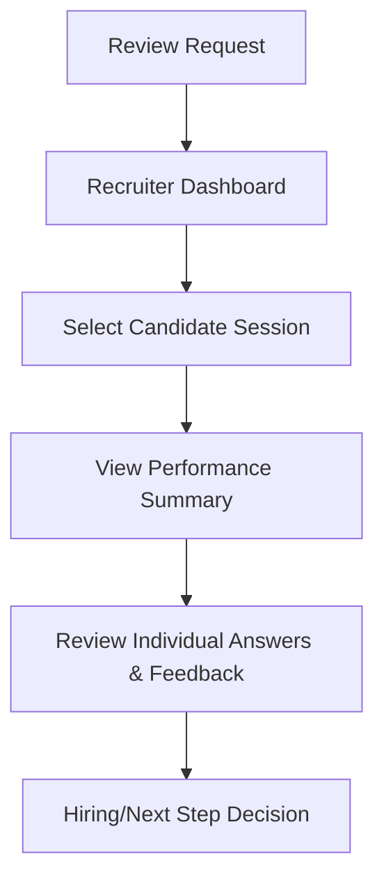
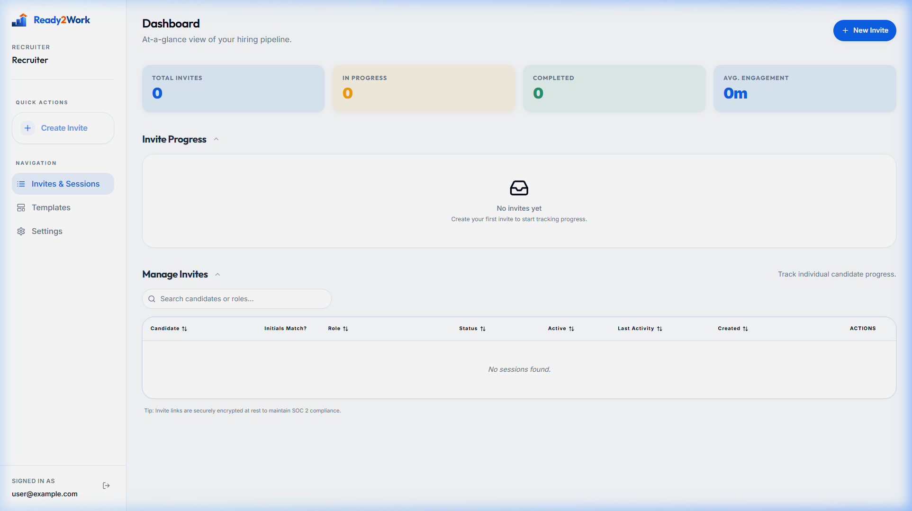

# UC-R2: Recruiter Reviews a Candidate Interview Session

## 1. Introduction
### 1.1.1. Scope:
Covers the phase where a Recruiter accesses the dashboard to review the performance, AI coaching insights, and overall readiness of a candidate who has completed their session.

### 1.1.2. Objective:
To provide recruiters with objective data points on candidate behavior, technical competency, and communication style to inform hiring decisions.

### 1.1.3. Actors:
- **Recruiter** (Primary)
- **AI Analysis Engine** (Secondary)
- **Transcription Service** (Secondary)

## 2. Business Requirements
### 2.1.1. User Needs and Goals:
- View a high-level summary of candidate performance.
- Drilled down into specific question responses and AI feedback.
- Compare candidate responses against job description benchmarks.

### 2.1.2. Business Needs and Goals:
- Reduce bias in interviewing through objective AI benchmarking.
- Support "Workforce Readiness" goals by identifying training gaps.
- Increase recruiter efficiency by highlighting high-signal moments in responses.

### 2.1.3. Preconditions:
- Candidate has completed the session.
- Session has been processed by the AI Analysis Engine.

## 3. Process Workflow Diagram

## 4. Use Case
### 4.1.1. Use Case 1: Recruiter Reviews Session
### 4.1.2. Description:
The recruiter navigates to the dashboard, finds the candidate (e.g., John Doe), and opens the session report. They see an executive summary, core strengths, and growth areas generated by the AI.

### 4.1.3. Navigation:
Recruiter Dashboard > "Manage Invites" Table > [Candidate Name]

### 4.1.4. Mock-up:

### 4.1.5. Acceptance Criteria:
- [x] Dashboard reflects session completion status accurately.
- [x] Executive Summary provides high-level narrative.
- [x] Strengths and Growth Areas clearly partitioned.
- [x] Specific question-level responses are accessible.

### 4.1.6. Accessibility Aspects:
- High contrast text for report readability.
- Screen reader support for performance metrics.

### 4.1.7. Compliance:
- Role-based access control (RBAC) ensures only authorized recruiters can view PII.
- Audit logs capture every time a session report is accessed.

### 4.1.8. Data Security:
- Transcriptions and AI analysis stored in encrypted storage.
- PII minimized in summary views.

### 4.1.9. Different Roles and Access:
- Recruiter: Full view.
- Interviewer: Question-level view.

### 4.1.10. Reports:
- Aggregated into "Quality of Hire" yearly reports.

### 4.1.11. Help Guide:
"AI feedback is a benchmark, not a replacement for human judgment."

### 4.1.12. Handling Retrospective vs. New Format:
New format includes "Req ID" tracking for cross-referencing with ATS systems.

### 4.1.13. Alternatives to Routine Solutions:
- **Audio Playback**: Listening to candidate recordings directly if audio mode was used.

### 4.1.14. Global Best Practices Followed:
- Blind evaluation components (optional) to reduce initial bias.

### 4.1.15. Global Organizations with Similar Practices:
- HireVue
- Modern Hire

## 5. Mockup Reference
*(See Dashboard screenshot in 4.1.4)*

## 6. Software BA Change Order Documentation Self-Verification Checklist
- [x] 1. Introduction & Objective clear and concise?
- [x] 2. Actors correctly identified?
- [x] 3. Preconditions & Post-conditions clearly stated?
- [x] 4. Main success scenario complete?
- [x] 5. Extensions (alternative/exception paths) identified?
- [x] 6. Business rules referenced accurately?
- [x] 7. Data requirements defined (inputs/outputs)?
- [ ] 9. Sign-off received from necessary stakeholders?

## 7. Sign-Off Decision
| Role | Decision | Date |
|------|----------|------|
| Product Owner | Pending | |

## 8. Consents and approval from various stakeholders at various stages
Pending approval.

## 9. Test Cases
| ID | Title | Priority | Step | Expected Result |
|----|-------|----------|------|-----------------|
| TC-R2.1 | Data Refresh | Medium | Refresh dashboard | Status updates to 'Completed' |

## 10. Technical Details
- Database view: `view_session_summaries`
- Frontend: `/recruiter/sessions/[id]`
