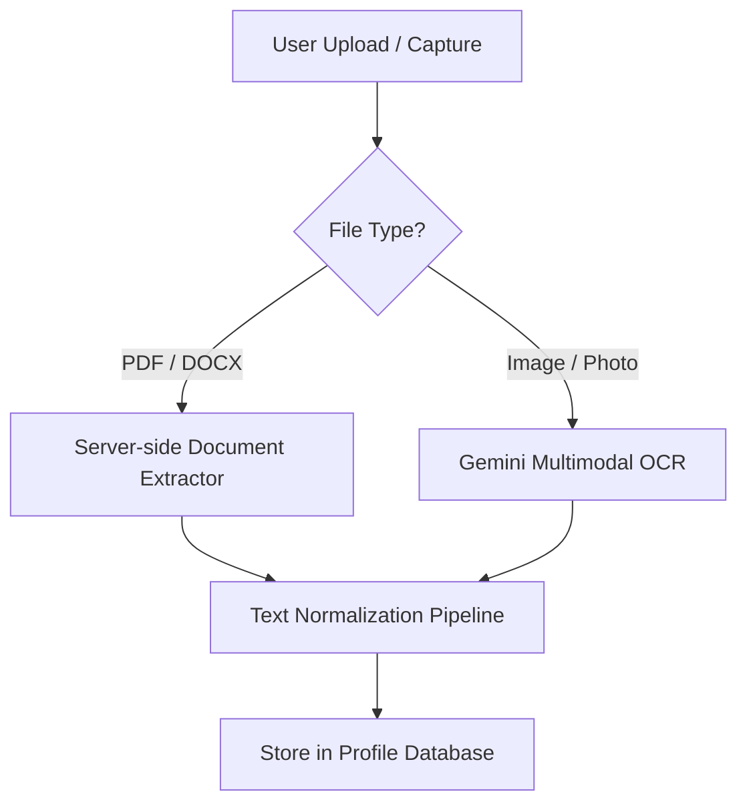

# Resume Ingestion, Capture, and Normalization Pipeline

This document outlines the mobile-first design patterns and technical options for landing resume ingestion (file upload & camera capture) and normalizing the extracted text for downstream LLM evaluation.

---

## 1. Mobile-First Ingestion Interfaces

To provide a seamless experience on both iOS and Android, we must distinguish between **File Picking** (accessing documents like PDF/DOCX) and **Camera Capture** (scanning a printed resume).

```text
Ingestion Action Sheet (Mobile):
 ----------------------------------
| Upload your Resume               |
|                                  |
|  [📄] Choose PDF / Word Doc      | <-- Triggers Files app
|  [📷] Scan Physical Resume       | <-- Triggers Camera Capture
|                                  |
|  [✕] Cancel                      |
 ----------------------------------
```

### Option A: Document File Picker (Avoid Photo Library defaults)
A common mobile UX failure is showing the photo library when asking for a resume. We can control the native OS picker using explicit file types and MIME configurations.

* **HTML/React Implementation**:
  ```tsx
  <input
    type="file"
    id="resume-file-picker"
    accept=".pdf,.docx,.txt,application/pdf,application/vnd.openxmlformats-officedocument.wordprocessingml.document,text/plain"
    className="sr-only"
    onChange={handleFileChange}
  />
  ```
* **OS Behavior**:
  * **iOS**: Correctly bypasses the photo library and opens the native **Files App** (iCloud Drive / local downloads).
  * **Android**: Opens the native **Documents/System File Selector** interface.

---

### Option B: Photo Scan / Camera Capture
If a candidate has a printed resume, they can scan it using their phone's camera.

* **Implementation**:
  ```tsx
  <input
    type="file"
    id="resume-camera-capture"
    accept="image/*"
    capture="environment" // Forces use of rear camera
    className="sr-only"
    onChange={handlePhotoCapture}
  />
  ```
* **OS Behavior**:
  * **iOS & Android**: Directly opens the native camera app in photo-capture mode. Once the photo is taken, it is passed directly back as a compressed file blob in the browser.

---

## 2. Text Extraction Strategy

Once the file/image blob is captured, it is transmitted to the server to extract raw text:



### A. Document Extraction (PDF, DOCX)
* **Strategy**: Process files on the server using high-performance parsing libraries.
* **Libraries**:
  * **PDFs**: `pdf-parse` (Node.js) extracts structural text streams.
  * **DOCX**: `mammoth` (Node.js) converts Word docs to clean markdown/plain text, preserving structure.
* **Pros**: High speed (100–300ms), offline extraction, and high fidelity.

### B. Image / Photo Extraction (Multimodal OCR)
* **Strategy**: Rather than deploying heavy third-party OCR engines, we leverage our existing multimodal connection to **Gemini**. We pass the image buffer directly to the API with structured prompt instructions.
* **Gemini Prompt Template**:
  ```text
  SYSTEM:
  You are an expert document OCR engine.
  Extract all text from the provided image of a resume.
  Maintain structural organization and sections (Education, Experience, Skills).
  Do not summarize, do not edit, do not correct spelling mistakes.
  Return only the raw extracted text.
  ```
* **Pros**: Unmatched hand-held page warp handling, lighting corrections, and section separation.

---

## 3. Text Normalization & Truncation Pipeline

Downstream LLM evaluators enforce a strict character limit (`EVIDENCE_FIRST_INPUT_LIMITS.resumeText = 24_000` characters, ~3,500–4,000 words). Raw extractions often include binary metadata, duplicate spaces, or formatting styles that consume token budgets.

### The Normalization Steps:
1. **Strip Binary Artifacts**: Remove raw styling tags, base64 strings, or PDF vector paths.
2. **Whitespace Collapsing**:
   * Replace multi-line empty lines with single line breaks.
   * Collapse multiple consecutive spaces into a single space.
3. **Structured Alignment**: Standardize sections to make them easily searchable by the evaluation engine:
   ```text
   --- SECTION: EXPERIENCE ---
   [Extract details...]

   --- SECTION: EDUCATION ---
   [Extract details...]
   ```
4. **Token-Safe Truncation**:
   ```typescript
   export function normalizeAndTruncateResume(rawText: string): string {
       const clean = rawText
           .replace(/[\r\n]+/g, "\n")       // Normalize carriage returns
           .replace(/[ \t]+/g, " ")         // Collapse spaces
           .trim();

       if (clean.length > 24000) {
           // Safely truncate at the last completed sentence to prevent incomplete word artifacts
           const truncated = clean.slice(0, 24000);
           const lastSentenceEnd = Math.max(
               truncated.lastIndexOf("."),
               truncated.lastIndexOf("!"),
               truncated.lastIndexOf("?")
           );
           return lastSentenceEnd > 20000
               ? truncated.slice(0, lastSentenceEnd + 1)
               : truncated;
       }
       return clean;
   }
   ```
