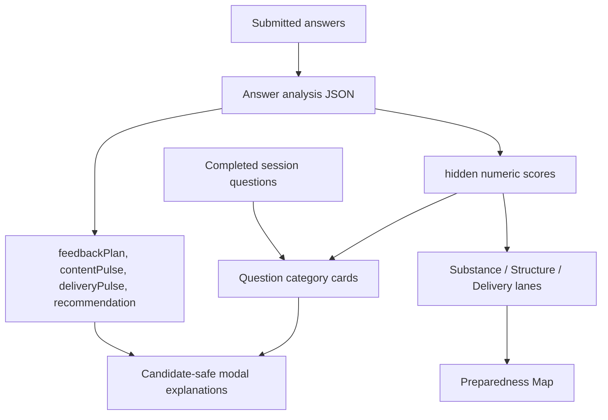
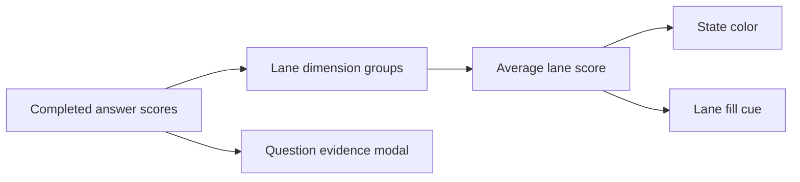

# Preparedness Signal Map

Status: Working reference
Last updated: 2026-06-01

## Purpose

This file maps the dashboard preparedness read model from source data to visible dashboard behavior.

It is intentionally concrete. It answers:

- which low-level signals exist now;
- which top-level lane each signal feeds;
- how evidence is constructed;
- how evidence state drives lane color, fill, and modal content.

Canonical contract: [Preparedness Signal Contract](./preparedness-signal-contract.md)

## Release Source Flow

## Release Dashboard Model

For this release, the dashboard should not derive preparedness from qualitative
`contentPulse`, `deliveryPulse`, or `feedbackPlan.primaryAnchor` inference.
Those fields can explain evidence in modals, but visible lane state and fill
come from the hidden numeric scores on completed-session feedback.

### Performance Lanes

| Lane ID | User-facing lane | What it shows |
| --- | --- | --- |
| `substance` | Answer Substance | Relevant, concrete, outcome-oriented, well-reasoned answer content. |
| `structure` | Interview Structure | Organization and signposting that make answers easy to follow. |
| `delivery` | Communication Delivery | Concision, clean delivery, and composure. |

Score dimensions:

- Substance: `focus_relevance`, `specificity_concreteness`, `outcome_explicitness`, `decision_rationale`.
- Structure: `structural_clarity`, `signposting`.
- Delivery: `filler_words`, `conciseness`, `resilience`.

### Score Mapping

| Average score | State | Surface |
| --- | --- | --- |
| No score | `not_practiced` | Gray, fully filled. |
| `1.0` to `<2.0` | `emerging` | Amber, fully filled. |
| `2.0` to `<3.0` | `emerging` | Amber with proportional blue fill. |
| `3.0` to `<4.0` | `clear` | Blue with proportional green fill. |
| `>=4.0` | `strong` | Green, fully filled. |

### Question Category Cards

Interview Range is not a lane for this release. Instead, the dashboard renders
question category cards for categories relevant to the selected target
interview context:

- Behavioral;
- Culture Fit;
- Technical / Role-Specific;
- Case / Scenario;
- Screening.

Each category card shows completed-session question count and a composite
average across all nine internal score dimensions for questions in that
category. Cards use the same score-to-state colors as the performance lanes,
without partial fill.

Screening means screening-only questions such as interest, background,
availability, logistics, or basic qualifications. Screening Basics in practice
setup can emphasize Culture Fit, but Culture Fit remains its own dashboard
category.

## Legacy PrepSignal Notes

The earlier `PrepSignal` map remains useful historical context, but it should
not drive the release dashboard. If kept in code temporarily, it should be
treated as a fallback or transitional read model only.

## Release Evidence Construction

Lane and category modal content should be built from completed-session question
evidence:

| Source | Candidate modal use |
| --- | --- |
| Question text | Shows what was practiced. |
| Answer modality | Shows whether evidence came from text or voice, once modality is reliably persisted. |
| `feedbackPlan.centralRead` | Candidate-safe explanation of what the coach noticed. |
| `contentPulse` / `deliveryPulse` | Short coach-language evidence when useful. |
| `recommendation` / `nextAction` | Candidate-safe next-step wording. |
| `scores` | Drives state and color, but should not be displayed as raw numeric scores in normal candidate UI. |

Normal dashboard UI must not show raw prompts, full transcripts, raw resume content, or AI-quality debug payloads.

## Release Lane Rollup

Fill is a visual cue only. Do not show percentages or numeric readiness in
normal candidate UI.

## Current Known Gaps

- Same-title target interviews are still grouped by target role until a profile selector lands.
- Role Fit is intentionally out of release scope.
- The current dashboard implementation still uses the transitional `PrepSignal` read model and must be replaced with the score-driven release read model.
- Category cards for Behavioral, Culture Fit, Technical/Role-Specific, Case/Scenario, and Screening are not implemented yet.
- Modal content needs a candidate-safe presentation of question evidence and feedback.
- Confidence is intentionally separate and not included as a lane.
