# Interview Preparedness Data Inventory

Date: 2026-05-27
Status: Working architecture inventory; narrowing toward dashboard V2 product and data contract

> [!NOTE]
> Canonical product/data anchors now live in [SPEC](../SPEC.md), [DATA_CONTRACT](../DATA_CONTRACT.md), and [HANDOFF](../HANDOFF.md). Keep this inventory as working/reference material for deeper interview-preparedness analysis until a release milestone.

## Purpose

This document maps the current candidate/recruiter Interview Coach data model to the interview preparedness experience now targeted for the candidate dashboard and practice setup.

The immediate goal is to clarify which objects and claims are likely to land, remove lower-probability branches, and keep the dashboard model grounded in data the app can actually explain.

Related docs:

- [SPEC](../SPEC.md)
- [DATA_CONTRACT](../DATA_CONTRACT.md)
- [HANDOFF](../HANDOFF.md)
- [Working Backlog](../00-working-backlog.md)
- [Candidate Dashboard And Practice V2 Disposable Spec](../candidate-dashboard-practice-v2-disposable-spec.md)
- [Interview Preparedness Signal Contract](./preparedness-signal-contract.md)
- [Postgres Candidate Data Contract](../reference-archive/architecture/postgres-candidate-data-contract.md)
- [Practice Session Draft Contract](../reference-archive/architecture/practice-session-draft-contract.md)
- [Candidate Session Engine Port Plan](../reference-archive/architecture/session-engine-port-plan.md)

## Product Position

The candidate dashboard should be organized around a candidate-owned `prepProfile`: the durable preparation context for a target interview.

The primary user contract is:

> Help me prepare for this interview by showing what successful preparation looks like, what I have practiced, what evidence I have built, and what I should do next.

The `prepProfile` is the organizing anchor. It contains a target role/JD context, candidate resume context when provided, practice sessions, answer evidence, coach findings, confidence measurements, and next recommended action.

Interview preparedness is not a single score. It is a scaffold of candidate-specific signals for a target interview. Each signal has an evidence state based primarily on practice evidence, with resume/JD context shaping which signals matter and how they should be framed.

The dashboard should support multiple active target interviews later, but the first durable model should work well for one `prepProfile`. Most candidates are expected to prepare for one to three roles at a time, so the system should not assume either a single lifetime role or an unlimited task-board model.

## Dashboard Preparedness Context To Preserve

The dashboard is still a greenfield product surface. Do not treat the current dashboard UI, placeholder lane states, or first-pass read model as final product truth.

The relatively mature parts of the app are:

- candidate/recruiter session creation;
- question generation;
- per-question answer evaluation and feedback;
- session summary/debrief generation.

The recruiter-led app did not need an ongoing candidate coaching dashboard, so the candidate dashboard needs a new cross-session preparedness layer. That layer must aggregate answer evidence, feedback signals, resume/JD context, confidence measurements, and prior-session patterns without flattening them into one score or one most-recent answer.

Important guardrails:

- Resume content is source evidence, not a preparedness lane. It should shape role-alignment, answer-content, example-selection, and coaching recommendations.
- A later strong observation must not hide an earlier weak one for the same category. Preserve observations, recency, source refs, and repeated themes so the dashboard can explain both progress and remaining gaps.
- `analysis.meta.modality` is AI-analysis/evaluation metadata. The canonical product state should be the persisted answer modality on `answers.modality`; mismatches between the two are diagnostics to fix, not a UI source of truth.
- `competencies` and `scoring_dimensions` are legacy/optional data unless a future implementation intentionally populates and consumes them. Prompt language can still discuss competencies, but dashboard claims must come from populated evidence.

## Current Direction

The emerging product/data model is now governed by the [Interview Preparedness Signal Contract](./preparedness-signal-contract.md). The current lane scaffold is intentionally immutable across prep profiles:

- Role Fit
- Answer Substance
- Interview Structure
- Communication Delivery
- Interview Range

The signal mix under those lanes varies by target role, JD, resume context, practice focus, and observed answer evidence.

The working type shape is:

```ts
type InterviewPrepSignal = {
    id: string;
    prepProfileId: string;
    label: string;
    lane:
        | "role_fit"
        | "answer_substance"
        | "interview_structure"
        | "communication_delivery"
        | "interview_range";
    source:
        | "job_description"
        | "question_generation"
        | "hint"
        | "strong_response"
        | "answer_feedback"
        | "session_summary"
        | "resume_strength"
        | "resume_gap"
        | "candidate_confidence"
        | "default_role_pattern";
    evidenceState: "not_practiced" | "emerging" | "clear" | "strong";
    evidenceRefs: Array<{
        type: "resume" | "answer" | "coach_feedback" | "summary";
        label: string;
        excerpt?: string;
    }>;
    nextAction?: {
        label: string;
        href: string;
    };
};
```

Working rules:

- JD context establishes target interview expectations.
- Resume context shapes the interview preparedness signals for this candidate, not just a separate comparison card.
- Practice answers and coach feedback determine signal evidence state.
- Summary feedback can synthesize evidence, but should not become the only source of truth.
- Confidence is a self-reported preparedness feeling, not a preparedness lane and not evidence of preparedness.
- "Was this helpful?" is UX/coaching-output feedback, not confidence data.
- Experience-evidence callouts remain valuable, but they should support the interview preparedness scaffold rather than replace it. Resume content and JD context are source evidence, not their own preparedness lane.

For example, two candidates can prepare for the same JD and still need different signals:

- Candidate A has direct role-specific tools/skills in the resume. Their signals should ask them to explain direct experience, depth, and role-specific judgment.
- Candidate B has adjacent experience. Their signals should ask them to connect transferable skills, explain learning agility, and make adjacent evidence concrete.

`prepProfile` is the product/domain name. The current persistence layer is still named `candidate_role_preparation_profiles`; treat that table name as an implementation detail until a future migration intentionally renames or aliases it.

## Prompt-Aligned Taxonomy

The preparedness model should reuse the taxonomy already implied by question generation, hints, strong response examples, answer feedback, and session summaries. This keeps the dashboard aligned with the actual coaching engine instead of creating a parallel readiness system.

| PrepProfile Lane | Existing Prompt/Runtime Source | Existing Primitive | Preparedness Use |
| --- | --- | --- | --- |
| Role Fit | Question generation, resume/JD context, hints, strong response, answer analysis | JD expectations, resume-context rules, direct/adjacent/transferable experience cues | Shows whether the candidate can connect their background to this target interview |
| Answer Substance | Answer analysis | `contentPulse`, hidden feedback dimensions, `FeedbackPlan.primaryAnchor` | Shows whether answers are relevant, specific, complete, outcome-oriented, and reasoned |
| Interview Structure | Answer analysis, question category, strong response | answer organization, behavioral/story expectations, signposting, `FeedbackPlan.intervention` | Shows whether answers are organized in ways interviewers can follow |
| Communication Delivery | Answer analysis | `deliveryPulse`, text-mode readability guidance, voice-mode delivery guidance | Separates spoken delivery signals from typed-answer clarity signals |
| Interview Range | Question generation and category mapping | Behavioral/Culture Fit/Technical categories, practice focus, generated question coverage | Shows coverage across the kinds of interview moments the candidate has practiced |
| Coaching signal | Answer feedback and summary | `FeedbackPlan.signal`, `FeedbackPlan.intervention`, `nextAction`, future `coachSignal` | Chooses the next learning focus without exposing raw scores |
| Confidence | Future candidate confidence capture | Pre/post session self-report | Shows self-perceived growth without treating confidence as performance evidence |
| Helpfulness/product feedback | `user_feedback` | "Was this helpful?" and session UX feedback | Improves product/coaching quality; does not count as preparedness evidence |

### Prompt Nuances That Matter

- Reading level and coaching rigor are role-sensitive. A `prepProfile` for a frontline role should use concrete, plain-spoken coaching; a senior role can ask for strategy, rationale, tradeoffs, and impact.
- Hidden numeric scores and hidden readiness levels are internal ordering tools only. They can help the model rank signals, but candidate UI should expose qualitative evidence states instead.
- `nextAction` remains an app-flow decision. It should not be treated as the candidate's learning goal.
- `feedbackPlan` is the strongest existing anchor for preparedness observations because it already separates signal valence, detectability, anchor, and intervention.
- `contentPulse` and `deliveryPulse` are the best existing basis for graphical progress that is not a score.
- Resume context should modify signal framing. Direct experience should lead to depth/judgment prompts; adjacent experience should lead to transferable-evidence prompts.
- Summary generation already inspects answer-level patterns. The future session-level `coachSignal` should receive structured answer-level context rather than forcing the dashboard to parse transcript prose.
- Question categories should remain unified and plain-language: Behavioral, Culture Fit, and Technical. Internal legacy names such as STAR/PERMA can remain implementation mappings.

### Evidence State Mapping Draft

| Evidence State | Meaning | Existing Data Clues | Safe Dashboard Claim |
| --- | --- | --- | --- |
| `not_practiced` | The signal matters for this target interview, but no usable answer evidence exists yet | JD/resume/question-generation signal with no submitted answer evidence | "Not practiced yet" |
| `emerging` | The candidate has attempted the signal, but evidence is thin, ambiguous, or missing a core piece | `feedbackPlan.signal.valence = growth` or `detectability = thin/ambiguous`; intervention often `repair_foundation` or `sharpen_signal` | "Starting to build evidence" |
| `clear` | The candidate has visible evidence, with one focused improvement still available | latest clear evidence, mixed/strength valence, moderate/clear detectability, useful `contentPulse` or `deliveryPulse` | "Clear evidence in practice" |
| `strong` | The candidate has strong or repeatedly clear support for the signal | latest strong evidence, strength valence, clear detectability, reinforce/amplify intervention, repeated support across sessions | "Strong evidence shown" |

This mapping is intentionally qualitative. It supports progress graphics and microinteractions without implying hiring suitability, ranking, or a numeric preparedness score.

### Lane Progression Rules

Preparedness Map lanes should not use a single "best" observation as the lane truth. A candidate can show one strong answer and still have unresolved growth evidence in the same lane. The current read model therefore treats lane state as a qualitative rollup of evidence counts:

| Evidence Mix | Lane State | Rationale |
| --- | --- | --- |
| No submitted-answer evidence | `not_practiced` | The signal exists because of the target interview context, but the app has no practice answer to cite yet. |
| Only thin/growth evidence | `emerging` | The candidate has started practicing, but the available evidence still needs a foundation or clearer signal. |
| Growth evidence plus clear/strong evidence | `clear` | The candidate has usable evidence, but the lane should not claim "strong" while unresolved growth evidence remains. |
| One especially strong observation and no unresolved growth evidence | `strong` | A clear strength signal with an amplify-strength intervention can support a strong qualitative state. |
| Multiple clear observations and no unresolved growth evidence | `strong` | Repeated clear evidence can support a strong qualitative state even without a single standout strength label. |
| One clear observation and no unresolved growth evidence | `clear` | The lane has evidence, but not enough repeated or standout support to call it strong. |

The read model also preserves `evidenceCounts` internally for each state. Dashboard UI can use those counts later to drive fill/progress microinteractions, but should not present them as a score.

Important signal-level exception: latest clear or strong evidence should immediately elevate the current state of that signal even if earlier evidence was weak. Prior weak evidence remains visible in the evidence history and can still influence coaching, but it should not block an obvious latest improvement. Regression should require meaningful repeated weak evidence, not one poor latest answer.

Initial dashboard use:

- `evidenceCounts` drive a quiet lane-fill treatment only.
- The UI does not expose percentages, ratios, or raw counts.
- Mixed growth and strength evidence fills a `clear` lane only partway, signaling progress with unresolved work.
- Drilldowns show traceable source evidence from `sourceRefs`; they do not become targeted-practice launchers until recommendation rules can safely create or prefill a focused next round.

## First PrepProfile Data Components

These are the first data components to use when implementing dashboard V2. They are intentionally derived-first unless noted otherwise, so the UI can prove the model before new normalized tables are added.

### `PrepProfile`

The durable candidate-owned preparation anchor.

Current backing:

- `candidate_role_preparation_profiles`;
- `candidate_practice_drafts.role_profile_id`;
- session `intakeData.roleProfileId`.

Fields the dashboard can safely use now:

```ts
type PrepProfile = {
    prepProfileId: string;
    candidateProfileId: string;
    targetRole: string;
    jobDescriptionSnapshot: string;
    resumeContextSnapshot?: unknown;
    status: "active" | "paused" | "archived";
    lastPracticedAt?: string;
};
```

Safe claim: "This practice work belongs to this target interview context."

### `InterviewContext`

The context that defines what the practice is preparing for.

Current backing:

- target role and JD from draft/session/profile;
- interview type / practice focus from draft intake;
- question count;
- resume context presence.

```ts
type InterviewContext = {
    prepProfileId: string;
    targetRole: string;
    jobDescription: string;
    practiceFocus?: "balanced" | "behavioral" | "technical" | "case" | "screening";
    resumeContextState: "none" | "present" | "processed";
};
```

Safe claim: "This is the interview context the app used to generate and evaluate practice."

### `PrepSignal`

The candidate-specific interview preparedness indicator. This is the core scaffold unit.

Current backing:

- JD-derived requirements from question generation;
- unified question categories;
- resume/JD evidence cues;
- `FeedbackPlan`;
- `contentPulse`;
- `deliveryPulse`;
- future `coachSignal`.

```ts
type PrepSignal = {
    signalId: string;
    prepProfileId: string;
    label: string;
    lane:
        | "role_fit"
        | "answer_substance"
        | "interview_structure"
        | "communication_delivery"
        | "interview_range";
    evidenceState: "not_practiced" | "emerging" | "clear" | "strong";
    evidenceCounts: Record<"not_practiced" | "emerging" | "clear" | "strong", number>;
    priority: "primary" | "supporting" | "background";
    sourceRefs: PrepEvidenceRef[];
};
```

Safe claim: "This is one preparation signal the candidate can build evidence for."

### `PrepEvidenceRef`

The traceable reason a signal exists or has its current state.

Current backing:

- JD text;
- processed resume context;
- question snapshot;
- answer transcript;
- `eval_results.feedback_json`;
- session summary.

```ts
type PrepEvidenceRef = {
    type:
        | "job_description"
        | "resume_context"
        | "question"
        | "answer"
        | "feedback_plan"
        | "content_pulse"
        | "delivery_pulse"
        | "coach_signal"
        | "summary";
    id?: string;
    label: string;
    excerpt?: string;
};
```

Safe claim: "Here is why this signal is shown."

### `PrepObservation`

An observed practice fact derived from answer feedback. This should remain a derived read-model object until the dashboard needs filtering, trend queries, or audit-grade traceability.

Current backing:

- `FeedbackPlan.signal.valence`;
- `FeedbackPlan.signal.detectability`;
- `FeedbackPlan.primaryAnchor`;
- `FeedbackPlan.intervention.type`;
- `contentPulse.dimension`;
- `deliveryPulse.dimension`.

```ts
type PrepObservation = {
    observationId: string;
    prepProfileId: string;
    sessionId: string;
    questionId: string;
    answerId: string;
    signalId?: string;
    source: "feedback_plan" | "content_pulse" | "delivery_pulse";
    state: "thin" | "growth" | "mixed" | "strength";
    summary: string;
};
```

Safe claim: "This practice answer produced evidence relevant to this signal."

### `PrepRecommendation`

The single next practice move for the `prepProfile`.

Current backing:

- unfinished sessions;
- `nextAction`;
- future `coachSignal`;
- session summary;
- confidence trend once captured.

```ts
type PrepRecommendation = {
    prepProfileId: string;
    source: "unfinished_session" | "answer_feedback" | "session_summary" | "confidence" | "first_practice";
    label: string;
    reason: string;
    href: string;
    sourceRefs: PrepEvidenceRef[];
};
```

Safe claim: "This is the next useful action based on the current prep profile state."

### `ConfidenceMeasurement`

Self-reported candidate confidence. This should be persisted separately from `user_feedback`.

Current backing:

- not fully implemented; `confidenceLevel` exists in draft intake, but is not yet a proper repeated measurement.

```ts
type ConfidenceMeasurement = {
    prepProfileId: string;
    sessionId?: string;
    moment: "pre_session" | "post_session";
    value: 1 | 2 | 3 | 4 | 5;
    label?: string;
    createdAt: string;
};
```

Safe claim: "This is how confident the candidate said they felt at this moment."

## First PrepProfile Signal Derivation Rules

This section defines the first deterministic rules for deriving `PrepSignal`, `PrepEvidenceRef`, `PrepObservation`, and `PrepRecommendation` without adding new persistence. These rules should run as a dashboard read-model layer first.

### Signal Seed Sources

| Source | Creates Or Updates | Rule | Notes |
| --- | --- | --- | --- |
| Required target role + JD | `InterviewContext`, Role Fit and Interview Range `PrepSignal` seeds | Always seed the `prepProfile` with target interview context. | This is the contract anchor, not proof of skill. |
| Question generation categories | Interview Range `PrepSignal` | Seed Behavioral, Culture Fit, and Technical coverage signals from generated question snapshots. | Use plain-language category mapping; do not expose STAR/PERMA internals. |
| Generated questions | Answer Substance and Interview Structure `PrepSignal` seeds | Use question text/framework/competency to infer what the candidate has an opportunity to demonstrate. | These signals begin as `not_practiced`. |
| Resume context present | `PrepEvidenceRef`, candidate-specific signal wording | If resume content exists, use it to shape role-alignment, answer-content, example-selection, and coaching recommendation signals. | Resume content is source evidence, not a lane; use conservative language unless candidate-confirmed evidence exists. |
| Submitted answers | `PrepObservation`, evidence refs | Each submitted answer can create observations tied to the question, answer, and feedback result. | Transcript excerpts should remain short and redacted/scrubbed where needed. |
| `FeedbackPlan` | `PrepObservation`, signal state update | Use valence, detectability, primary anchor, and intervention type as the strongest evidence-state input. | This is the primary qualitative evidence source. |
| `contentPulse` | Answer Substance and Interview Structure `PrepObservation` | Map pulse dimensions to content signals such as relevance, structure, specificity, outcomes, and rationale. | Better for graphical progress than raw hidden scores. |
| `deliveryPulse` | Communication Delivery `PrepObservation` | Map voice-mode pulse dimensions to delivery signals and text-mode pulse dimensions to written clarity/readability. | Do not critique vocal delivery for typed answers. |
| Future `coachSignal` | `PrepRecommendation`, signal priority | Use as the single learning-focus pointer once it replaces `oneBigUpgrade`. | It should support, not compete with, `nextAction`. |
| Summary output | session-level evidence refs | Use summary themes as synthesis evidence after answer-level observations exist. | Do not make summary prose the only source of truth. |
| Confidence measurements | Confidence trend | Capture self-reported change over time. | Never treat confidence as performance evidence or a preparedness lane. |

### Content Pulse Mapping

| Pulse Dimension | Prep Lane | Default Signal Label | Evidence Meaning |
| --- | --- | --- | --- |
| `focus_relevance` | `answer_substance` | Answer the question being asked | Candidate stays connected to the prompt and role expectation. |
| `structural_clarity` | `interview_structure` | Make the answer easy to follow | Candidate gives the interviewer a clear setup, action, and result path. |
| `specificity_concreteness` | `answer_substance` | Use concrete examples | Candidate avoids vague claims and gives observable detail. |
| `outcome_explicitness` | `answer_substance` | Show what changed | Candidate names the result, effect, or learning from the example. |
| `decision_rationale` | `answer_substance` | Explain why you chose that action | Candidate shows judgment, tradeoffs, and role-appropriate reasoning. |

### Delivery And Readability Mapping

| Pulse Dimension | Voice Mode Meaning | Text Mode Meaning | Default Signal Label |
| --- | --- | --- | --- |
| `filler_words` | Reduce distracting filler or restarts | Usually not applicable unless transcript shows repeated filler text | Keep delivery clean |
| `signposting` | Help the listener follow transitions | Use clear written structure and transitions | Guide the interviewer through the answer |
| `conciseness` | Stay focused without over-talking | Avoid overlong or unfocused written responses | Keep the answer tight |
| `resilience` | Recover after pauses or uncertainty | Revise uncertainty into a clearer answer path | Stay composed when the answer is hard |

### FeedbackPlan Mapping

| FeedbackPlan Field | Prep Use |
| --- | --- |
| `signal.valence = strength` | Candidate has useful evidence; default state can move to `clear` or `strong` depending on detectability and repetition. |
| `signal.valence = mixed` | Candidate has partial evidence; default state can move to `emerging` or `clear`. |
| `signal.valence = growth` | Candidate has attempted the signal but needs a foundational improvement; default state is `emerging`. |
| `signal.detectability = clear` | Evidence can be shown confidently in the dashboard. |
| `signal.detectability = moderate` | Evidence can be shown with careful wording. |
| `signal.detectability = ambiguous` | Avoid hard claims; frame as a practice target. |
| `signal.detectability = thin` | Treat as `emerging` at most; do not imply the candidate demonstrated the signal. |
| `primaryAnchor.source = content` | Creates or supports an Answer Substance signal, except `structural_clarity`, which supports Interview Structure. |
| `primaryAnchor.source = delivery` | Creates or supports a Communication Delivery signal. |
| `primaryAnchor.source = fallback` | Creates a dimension-based fallback signal, usually in Answer Substance unless the dimension maps to structure. |
| `primaryAnchor.dimension` | Provides the stable low-level signal id when `contentPulse` or `deliveryPulse` does not already cover that dimension. |
| `primaryAnchor.candidateEvidence` | Provides the candidate-safe source excerpt for the signal drilldown. |
| `intervention.type = repair_foundation` | Prioritize as foundational work; usually `emerging`. |
| `intervention.type = sharpen_signal` | Candidate has a base to improve; usually `emerging` or `clear`. |
| `intervention.type = polish_response` | Candidate is generally on track; usually `clear`. |
| `intervention.type = amplify_strength` | Candidate should repeat or deepen a strength; usually `clear` or `strong`. |

### Evidence State Derivation

Evaluate a signal from the most specific evidence available. Prefer answer-level `FeedbackPlan` and pulses over session summary prose.

| Evidence State | Deterministic Rule |
| --- | --- |
| `not_practiced` | Signal exists from JD/question/resume context, but there is no submitted answer with feedback evidence tied to it. |
| `emerging` | Any tied `FeedbackPlan` has `valence = growth`; or detectability is `thin`/`ambiguous`; or intervention is `repair_foundation`; or the only evidence is a weak/partial pulse. |
| `clear` | Tied evidence has `valence = mixed` with `detectability = moderate/clear`; or `valence = strength` with `detectability = moderate`; or intervention is `sharpen_signal`/`polish_response` with a usable evidence ref. |
| `strong` | Tied evidence has `valence = strength`, `detectability = clear`, and intervention is `amplify_strength`; or the same signal has repeated `clear` observations across more than one question/session. |

Tie-breakers:

- Use hidden scores only as internal tie-breakers when two signals have the same qualitative state.
- Never expose hidden score values, hidden readiness levels, or score-derived labels to the candidate.
- If source evidence conflicts, choose the more conservative evidence state and surface the conflict in the drilldown copy later.

### Recommendation Priority

The dashboard should choose one primary `PrepRecommendation` in this order:

1. Resume an unfinished candidate-owned session.
2. Practice the highest-priority `emerging` signal with direct evidence from the latest completed session.
3. Practice the highest-priority candidate-specific signal shaped by resume/JD context when useful evidence exists but has not appeared in answers.
4. Practice an interview-behavior lane that has generated questions but no submitted answer evidence.
5. Reflect on confidence movement when confidence drops or stays low after a completed session.
6. Start first practice when no completed or active session exists.

This ordering keeps the dashboard actionable without turning preparedness into a score.

### Implementation Guardrails

- Start as a pure read-model service over current rows and JSON payloads.
- Keep the implementation deterministic and testable before introducing another model call.
- Persist normalized signal/observation rows only after the dashboard interaction model proves which fields need stable IDs.
- Add source refs for every visible claim, even if the first UI only uses them internally.
- Keep candidate-led `prepProfile` evidence separate from recruiter-invited sessions unless a future merge policy is explicitly approved.

### First Service Boundary

Implemented first as a pure service:

- [prepProfile read model service](../../../src/lib/server/candidate/prep-profile-read-model.ts)
- [prepProfile read model tests](../../../src/lib/server/candidate/prep-profile-read-model.test.ts)

The service currently accepts a `prepProfileId`, target interview context, question snapshots, answer analyses, summary text, resume-context state, and optional active-session href. It returns derived `PrepSignal`, `PrepObservation`, and `PrepRecommendation` objects without querying Postgres and without writing new persistence.

This is intentionally not yet wired into the dashboard loader. The next implementation pass should map current dashboard rows/session detail into this service, then decide which returned fields are safe and useful to display.

## Design Guardrails

- Do not create a numeric preparedness score.
- Do not imply hiring suitability, pass/fail status, or candidate ranking.
- Use layered preparedness evidence instead of flat scoring.
- Prefer target-interview progress over generic app activity.
- Prefer graphical, interactive presentation over long explanatory text.
- Use quantitative data only for behavior, coverage, confidence, and completion.
- Use qualitative data for coaching meaning, role relevance, examples, and next steps.
- Treat preparedness as a scaffold that shows preparation coverage and evidence, not as a verdict.

## Consolidated Working Views

These diagrams are intentionally sparse. They are meant to reduce the amount of back-and-forth scanning needed during dashboard and practice design, not replace the detailed tables below.

### Interview Preparedness System Map

This view shows the current objects, current supported claims, unsupported claims, and likely new objects needed to close the gap.



Source: [role-preparedness-system-map.mmd](./assets/role-preparedness-system-map.mmd)

### Candidate Interview Preparedness Flow

This view shows how the current app moves from setup to coaching, and where the future interview preparedness layer would aggregate meaning for the dashboard.



Source: [candidate-role-readiness-flow.mmd](./assets/candidate-role-readiness-flow.mmd)

## Current Persisted Data Objects

| Object | Current Role | Preparedness Value | Reuse Notes |
| --- | --- | --- | --- |
| `candidate_profiles` | Candidate account/profile anchor | Candidate identity for role preparation workspaces | Reuse as candidate owner; do not duplicate candidate identity in new prep objects |
| `candidate_identities` | External identity provider mapping | Future TalentArbor/RangamWorks SSO handoff | Reuse for auth provenance, not dashboard logic |
| `candidate_practice_drafts` | Candidate setup and generation state | Target role, JD, resume context, intake, resume target, session link | Current best anchor for pre-session role context |
| `sessions` | Shared interview session record | Target role, JD, status, current question, summary, engagement time | Reuse for session facts; candidate-led source may need clearer first-class classification later |
| `questions` | Question snapshot under a session | Question category, framework, competency, tips, generated prompt | Reuse as practiced-role-signal evidence |
| `answers` | Candidate answer attempts | Transcript, modality, submitted time, analysis payload | Reuse for answer evidence and feedback replay |
| `eval_results` | Persisted answer feedback | Structured coaching output, recommendation, feedback plan, future `coachSignal` | Primary source for observed skill signals |
| `ai_generations` | AI-quality capture | Prompt/version/input/output/cost/latency/redaction metadata | Reuse for QA/observability, not candidate dashboard content |
| `events` | Event log | Activity trace, future interaction and micro-conversion evidence | Use for observability and behavior history, not interview preparedness by itself |
| `user_feedback` | Helpfulness/session UX feedback | Candidate reaction to coaching outputs or session UX | Reuse for "Was this helpful?" and product-quality signals; do not use as core confidence trend storage |
| `candidate_role_preparation_profiles` | `prepProfile` persistence layer | Durable target interview/JD anchor for candidate preparation | Implemented as the first interview preparedness persistence layer; table name remains the current physical contract |

## Current Runtime And Domain Objects

| Object | Current Role | Preparedness Value | Reuse Notes |
| --- | --- | --- | --- |
| `Question` | Runtime prompt model | Category, framework, competency, tips | Already supports a basic practice taxonomy |
| `QuestionTips` | Do/avoid hints | Pre-answer coaching | Can map to learning scaffolds and reference content |
| `StrongResponseResult` | Example answer and explanation | "What good looks like" for a question | Useful for question library and role-specific examples |
| `Answer` | Candidate response object | Transcript, modality, analysis | Reuse for answer evidence and coaching replay |
| `FeedbackPlan` | Structured answer analysis | Signal valence, detectability, anchor, intervention | Strongest existing object for qualitative preparedness observation |
| `AnalysisResult` | Full answer feedback payload | Ack, pulses, recommendation, next action, metadata, feedback plan | Current feedback payload; should evolve from `oneBigUpgrade` to `coachSignal` |
| `InterviewSession` | Shared session domain model | Role, JD, questions, answers, status, summary, engagement time | Reuse for both invite and candidate-led session state |
| `CandidatePracticeDraft` | Candidate setup domain model | Role, JD, resume context, intake, session link | Reuse for `prepProfile` setup state |
| `CandidatePracticeIntakeResponses` | Lightweight intake | Confidence, interview type/focus, timeline, concerns | Needs hardening before it becomes interview-prep intake |
| `CandidateDashboardModel` | Current dashboard read model | Candidate stats, active/completed items, next best action | Useful MVP read model; not yet a `prepProfile` scaffold |
| `QuestionGenerationInput` | Shared question generator input | Role, JD, resume, interview type, question count | Reuse for role-specific practice generation |

## Current Derived Concepts

| Concept | Source | Current State | Preparedness Use |
| --- | --- | --- | --- |
| Target role | Draft and session | Required setup input | Required context inside the `prepProfile` |
| Job description context | Draft and session | Required setup input | Defines interview signals and expectations |
| Resume context | Draft resume JSON | Optional pasted/uploaded processed artifact | Defines source evidence and shapes candidate-specific signal wording, examples, and recommendations |
| Interview type / practice focus | Draft intake JSON | Lightweight optional setup control | Currently changes generation emphasis; may become a practice-path selector |
| Question category | Question snapshot | Shared chip mapping now unified | Basic practice coverage dimension |
| Hints and examples | Question tips and strong response | Generated during session | "What good looks like" and learning support |
| Feedback plan | Answer analysis | Structured but mostly hidden | Foundation for qualitative skill observations |
| Next action | Answer analysis | Drives retry/continue/finish flow | App action, not a learning signal |
| One big upgrade | Answer analysis and dashboard read model | Transitional concept | Replace with `coachSignal`; do not build further around this name |
| Engagement time | `sessions.intake_json.engaged_time_seconds` | Captured by hidden debug flow | Use as context only, not proof of preparedness |
| Summary narrative | Session | Generated on completion | Candidate-facing session synthesis |
| Confidence | Future pre/post session capture | Not fully wired as trend data | Use dedicated self-reported confidence measurements, not `user_feedback`, and do not treat as performance evidence |

## What Existing Data Can Already Support

The current data can support a stronger dashboard without new persistence if the UI stays within these claims:

- active practice round by role;
- completed practice rounds by role;
- latest answer-level coaching focus;
- latest session summary;
- practiced question categories;
- answer modality history;
- resume/JD presence;
- candidate self-reported confidence if capture is wired;
- session engagement time as background context;
- deterministic next action from active/completed state.

It should not yet claim:

- complete interview preparedness;
- verified skill mastery;
- exhaustive role-signal coverage;
- resume/JD gap accuracy as a standalone lane or verdict;
- cross-role growth trends;
- benchmark comparison against other candidates;
- hiring decision quality.

## Likely Dashboard Data Model

The dashboard V2 model should move from "possible UI surfaces" to a `prepProfile` read model that can explain every visible claim.

### PrepProfile Workspace

Likely to land:

- one active `prepProfile` as the first-class dashboard context;
- later role switcher for one to three concurrent `prepProfiles`;
- role context summary from target role, JD snapshot, and resume context state;
- unfinished practice continuation;
- latest recommended action for the target interview.

Current support:

- `candidate_role_preparation_profiles` table exists;
- new drafts link to a prep profile through the current `role_profile_id` column;
- session `intakeData` carries `roleProfileId` as the current implementation field;
- older rows can still fall back to candidate-owned role/JD grouping.

### Interview Preparedness Scaffold

Likely to land:

- layered preparedness map or scaffold;
- candidate-specific preparedness signals;
- qualitative evidence states: `not_practiced`, `emerging`, `clear`, `strong`;
- progressive reveal interactions showing why a signal exists and what evidence supports it;
- next practice action tied to the highest-value signal.

Current support:

- question categories exist;
- answer feedback has structured qualitative signal;
- completed session history exists;
- prep profile anchor exists;
- current focus-path progress is placeholder-like and should be replaced by signal evidence states.

Needed before durable implementation:

- deterministic signal derivation rules;
- deterministic evidence-state rules;
- traceability from each visible signal to JD, resume, answer, coach feedback, or summary evidence.

### Experience Evidence

Likely to land:

- resume/JD context shapes the candidate's preparedness signals;
- separate experience-evidence callouts explain how resume evidence can be used in practice;
- evidence prompts launch or prefill targeted practice only after the Preparedness Map interaction model is validated;
- evidence language frames gaps as bridge-building, not deficiency.

Current support:

- JD text is required for new practice setup;
- processed resume context exists;
- answer transcripts and coaching signals exist.

Needed before durable implementation:

- extracted or derived role signals;
- candidate evidence snippets from resume and answers;
- evidence-source traceability;
- conservative copy for unconfirmed extraction.

### Practice Path

Likely to land:

- one recommended next practice action for the role;
- later path steps derived from unresolved preparedness signals;
- practice setup prefilled by the selected signal/focus;
- path completion shown as evidence state movement, not percentage score.

Current support:

- active/completed session state exists;
- latest feedback signal exists;
- practice focus and question count can influence generation.

Needed before durable implementation:

- signal-priority rules;
- prefilled practice setup contract;
- distinction between candidate-selected focus and app-recommended focus.

### Confidence Trend

Likely to land:

- before/after confidence markers;
- recent confidence trend;
- first baseline to latest confidence movement;
- reflection prompt after practice.

Current support:

- `confidenceLevel` exists in draft intake;
- no dedicated confidence measurement table exists yet.

Needed before durable implementation:

- consistent pre-session and post-session capture points;
- dedicated persistence separate from `user_feedback`;
- dashboard trend query;
- copy that makes confidence self-report, not performance score.

### Question Library And Learning Reference

Likely direction:

- keep this as future supporting surface, not a dashboard V2 dependency;
- start with session-generated question replay and category explanation content;
- defer curated cross-candidate question bank until content ownership and privacy posture are clearer.

Current support:

- generated question snapshots exist;
- categories and strong responses exist.

Needed before durable implementation:

- decision whether the library is generated-from-history, curated, or both;
- reference content ownership;
- privacy posture for generated/personalized examples.

## Duplicate And Reuse Check

Before adding tables or services, treat each proposed dashboard claim as one of five implementation categories:

- **Use existing data for now**: current tables and JSON payloads can support the claim without new persistence.
- **Derived read model first**: build query/service logic over existing records before adding a table.
- **Persist soon**: the object is likely needed for coherent interview preparedness behavior.
- **Future only**: valid product idea, but not required to stabilize V2 dashboard direction.
- **Probably unnecessary**: avoid unless a future workflow proves the need.

| Desired Capability | Reuse First | MVP Claim It Safely Supports | Claim It Cannot Support Yet | Current Decision | Add New Only If |
| --- | --- | --- | --- | --- | --- |
| PrepProfile workspace | `candidate_role_preparation_profiles`, draft/session role fields | Candidate can see active/completed work grouped around a durable target interview/JD context | Candidate has a polished multi-profile management model with archived/versioned workspaces | Landed first layer | Candidate needs richer switching, versioning, or archive/reopen UX |
| Role context | Draft JD/resume context | App can show whether JD/resume context exists and use it during generation | Candidate can manage an evolving role context or compare versions over time | Derived read model first | Candidate needs role-context versioning, review, or reuse across sessions |
| Interview prep signals | JD text, resume context, question categories, generated questions, `FeedbackPlan` | Dashboard can show candidate-specific preparation indicators with conservative evidence states | Dashboard can treat signals as stable reusable objects with review/version history | Derived read model first | Signal IDs need reuse across sessions, targeted practice, or candidate-visible drilldowns |
| Prep observations | `eval_results.feedback_json`, answer `analysis`, `FeedbackPlan`, `contentPulse`, `deliveryPulse` | Dashboard can replay latest coaching signals and summarize recent themes | Dashboard can reliably aggregate skill/focus patterns across sessions without parsing JSON on every load | Derived read model first | Dashboard interactions need normalized filters, trend queries, or milestone evidence |
| Coach recommendation | `nextAction` plus future `coachSignal` | App can choose a next step from current/last session state | App can reason over a long-running `prepProfile` with expiry, priority, and multiple recommendation sources | Derived read model first | Recommendations need cross-session aggregation, override logic, or audit history |
| Confidence trend | Future confidence measurements | Candidate can record and review self-reported confidence at known moments | App can compare pre/post confidence consistently across sessions and prep profiles | Persist soon | Confidence becomes a repeated prep/session measurement; do not store as generic `user_feedback` |
| Experience evidence | Draft processed resume context, JD text, answer transcripts | App can suggest how resume evidence can support role preparation and targeted practice | App can claim complete or verified gap mapping between resume, role expectations, and practiced answers | Derived read model first | Resume/answer evidence needs review state, traceability, or targeted practice reuse |
| Learning library | Question snapshots, hints, strong responses | Candidate can revisit generated session questions and examples | App can offer a curated, reusable, role-specific question bank/reference library | Future only | Content must be shared, curated, versioned, or reused across candidates |
| Progress milestones | Interview prep signals and observations | Candidate can see which signals are not practiced, emerging, clear, or strong | Candidate can see earned interview preparedness milestones backed by stable evidence rules | Future only | Milestones become core to microinteractions after signal states are validated |
| Hiring readiness | None | No safe candidate-facing claim | App cannot claim hiring suitability, pass/fail status, ranking, or complete readiness | Probably unnecessary | Avoid unless legal/product policy explicitly approves a non-decision-support formulation |

## Likely Objects And Timing

These objects represent the narrowed data direction. Some are already landed at the first persistence layer; others should be derived first and persisted only after the UI/data rules prove stable.

| Object | Classification | Why |
| --- | --- | --- |
| `candidate_role_preparation_profiles` / `prepProfile` | Landed first layer | Target interview/JD is the durable organizing unit, not a transient session label |
| `candidate_confidence_measurements` | Persist soon | Confidence is a repeated self-report signal tied to role/session moments, not generic feedback |
| `prep_profile_signals` / `interview_prep_signals` | Derived first, likely persist later | Preparedness depends on explicit indicators; derive first to validate taxonomy and UI claims before persisting |
| `candidate_evidence_items` | Derived first, likely persist later | Resume and answer evidence should power bridge interactions, but extraction quality and candidate review state need validation |
| `skill_signal_observations` | Derived read model first | Existing `feedbackPlan` and answer analysis should drive first aggregation before normalization |
| `interview_prep_milestones` | Future only | Promising for microinteractions, but should follow validated signals and evidence states |
| `question_bank_items` | Future only | Candidate can revisit generated questions first; curated/reusable library can come later |

### `candidate_role_preparation_profiles` (`prepProfile`)

One `prepProfile` per candidate and target-interview context.

Implemented fields:

- `role_profile_id`
- `candidate_profile_id`
- `target_role`
- `job_description_snapshot`
- `resume_context_snapshot_id`
- `status`
- `created_at`
- `updated_at`
- `last_practiced_at`

Purpose:

- establish the target interview as the app's dashboard anchor;
- group drafts, sessions, summaries, confidence, and recommendations;
- make multi-target preparation manageable.

Current recommendation:

- treat this as the landed first persistence layer for interview preparedness;
- attach existing drafts and sessions by `candidate_profile_id` plus a normalized prep profile reference;
- store the role/JD/resume snapshots as candidate-owned preparation context, not as recruiter-visible evidence;
- keep this object free of score-like fields.

This object should own:

- target role label;
- required JD snapshot;
- optional processed resume context reference/snapshot;
- status such as `active`, `paused`, or `archived`;
- timestamps for creation, update, and last practice.

This object should not own:

- raw resume files;
- recruiter invite state;
- hiring-decision fields;
- numeric preparedness scores.

### `prep_profile_signals` / `interview_prep_signals`

Candidate-specific interview preparedness indicators inferred from JD, role name, resume context, generated questions, answer evidence, and coach feedback.

Implemented or intended fields:

- `prep_signal_id`
- `prep_profile_id`
- `label`
- `category`
- `source`
- `source_text`
- `evidence_state`
- `evidence_refs_json`
- `priority`
- `created_at`

Purpose:

- define what successful preparation for this target interview should cover;
- support graphical coverage without scoring the candidate.
- allow resume context to shape the signal set and wording for this candidate.

Current recommendation:

- derive first from JD text, resume context, generated questions, question categories, answer feedback, and summary patterns;
- persist only after the UI proves which signals should be reusable and how candidates should interpret them;
- include source traceability if persisted so the UI can explain why a signal exists.

Signal examples:

| Scenario | Signal Direction |
| --- | --- |
| Resume shows direct required tool/domain experience | Explain direct experience with the tool/domain and show depth |
| Resume shows adjacent experience but not the exact requirement | Connect transferable work to the role requirement |
| Practice answer demonstrates a required behavior | Move the signal toward `clear` or `strong` evidence |
| Practice answer avoids or misses the requirement | Keep the signal `not_practiced` or `emerging` and recommend targeted practice |

### `candidate_evidence_items`

Reusable pieces of candidate evidence from resume content and practice answers.

Possible fields:

- `evidence_item_id`
- `role_profile_id`
- `source_type`
- `source_id`
- `evidence_text`
- `candidate_review_state`
- `created_at`

Purpose:

- connect resume and answer evidence to interview prep signals;
- power experience-aware signal explanations and targeted practice.
- provide traceability for microinteractions that explain why a signal is `emerging`, `clear`, or `strong`.

Current recommendation:

- derive first from processed resume context and submitted answer transcripts;
- persist only when candidate review, reuse, or targeted practice generation needs stable evidence IDs;
- avoid presenting extracted evidence as definitive unless the candidate has reviewed or confirmed it.

### `skill_signal_observations`

Normalized observations derived from answer feedback.

Possible fields:

- `observation_id`
- `role_profile_id` / `prep_profile_id` alias
- `session_id`
- `question_id`
- `answer_id`
- `dimension`
- `observation_state`
- `evidence_summary`
- `source_feedback_ref`
- `created_at`

Purpose:

- avoid repeatedly parsing feedback JSON for dashboard aggregation;
- support scaffold states and microinteractions.
- convert coach feedback into reusable answer evidence without exposing score-like model internals.

Current recommendation:

- derive first from `eval_results.feedback_json`, answer `analysis`, and `FeedbackPlan`;
- persist after `coachSignal` replaces `oneBigUpgrade` and the feedback schema stabilizes;
- use qualitative states such as `observed`, `practiced`, `strengthening`, and `evidenced` instead of scores.

### `interview_prep_milestones`

Non-score progress states earned through practice.

Possible fields:

- `milestone_id`
- `prep_profile_id`
- `milestone_key`
- `label`
- `state`
- `earned_at`
- `evidence_ref`

Purpose:

- create visible accomplishment without gamified point scoring;
- support tappable reveals and explanation cards.

Current recommendation:

- keep future-only for now;
- define milestone labels after preparedness signal and observation rules are stable;
- use milestones as evidence-backed interaction affordances, not daily streaks or scoring.

### `candidate_confidence_measurements`

Repeated self-report confidence measurements.

Possible fields:

- `confidence_measurement_id`
- `role_profile_id`
- `session_id`
- `moment`
- `value`
- `label`
- `created_at`

Purpose:

- separate confidence trend from answer evaluation;
- avoid treating confidence as a model-scored performance metric.

Current recommendation:

- persist soon if confidence trend remains a dashboard V2 visual;
- collect before and after each practice session;
- scope measurements to candidate, prep profile, session, and moment;
- keep confidence language clearly self-reported.

### Objects Not Recommended Yet

| Object | Decision | Reason |
| --- | --- | --- |
| `question_bank_items` | Future only | Generated question snapshots already support revisit/history; curated bank needs content ownership |
| `practice_path_templates` | Future only | Paths should be derived from current recommendation rules before becoming templates |
| `interview_preparedness_scores` | Probably unnecessary | Conflicts with the non-score design posture and can imply hiring suitability |
| `candidate_skill_scores` | Probably unnecessary | Encourages false precision and stakeholder misuse |
| `hiring_fit_assessments` | Probably unnecessary | Out of scope for candidate-led practice and should not enter the candidate dashboard model |

## PrepProfile Boundary Draft

`candidate_role_preparation_profiles` is the current table name for the `prepProfile` parent concept in dashboard V2.

It would group:

- candidate-owned practice drafts for that target interview;
- candidate-owned sessions for that target interview;
- generated summaries for those sessions;
- confidence measurements for those sessions;
- future interview prep signals and evidence items;
- latest coach recommendation for what to practice next.

It would not group:

- recruiter-invited sessions unless a future user-visible merge policy exists;
- recruiter, hiring manager, or employer decision workflows;
- raw uploaded resume files;
- admin/QA artifacts except by internal support/audit lookup.

The first implementation does not need to migrate all historical rows immediately. It can:

1. create the prep profile table;
2. create a prep profile when a candidate starts or restores a practice draft;
3. link new candidate drafts/sessions to the prep profile;
4. let the dashboard continue deriving older rows by role string until backfill is needed.

## PrepProfile Migration Contract Draft

This is the first persistence contract for the interview preparedness dashboard direction.

Implementation status:

- [Candidate role preparation profiles schema migration](../../../db/migrations/004_candidate_role_preparation_profiles_schema.sql) creates the table and nullable draft link.
- [Candidate role preparation profiles rollback smoke](../../../db/validation/006_candidate_role_profiles_schema_smoke.sql) validates linked draft/profile behavior and core constraints.
- [Candidate role profile repository](../../../src/lib/server/candidate/candidate-role-profile-repository.ts) resolves or creates active/paused profiles by candidate, normalized role, and JD hash.
- [Candidate practice draft repository](../../../src/lib/server/candidate/candidate-practice-draft-repository.ts) stores `role_profile_id` on new or relinked drafts.
- [Candidate session creation service](../../../src/lib/server/candidate/candidate-session-creation-service.ts) carries `roleProfileId` into session `intakeData`.

### Table

`candidate_role_preparation_profiles`

Recommended fields:

| Field | Type | Requirement | Notes |
| --- | --- | --- | --- |
| `role_profile_id` | `uuid` | required primary key | Default generated by Postgres |
| `candidate_profile_id` | `uuid` | required foreign key | References `candidate_profiles(candidate_profile_id)` |
| `target_role` | `text` | required | Candidate-facing role label |
| `normalized_target_role` | `text` | required | Lowercased/collapsed role string for lookup and dedupe |
| `job_description_snapshot` | `text` | required | Frozen JD context for this prep profile |
| `job_description_hash` | `text` | required | Stable hash for dedupe/change detection without comparing long text |
| `resume_context_snapshot_json` | `jsonb` | nullable | Optional processed resume context associated with this profile |
| `source` | `text` | required | Suggested values: `manual`, `host_platform`, `dev_seed` |
| `status` | `text` | required | Suggested values: `active`, `paused`, `archived` |
| `last_practiced_at` | `timestamptz` | nullable | Updated when a linked session starts or completes |
| `created_at` | `timestamptz` | required | Default `now()` |
| `updated_at` | `timestamptz` | required | Updated by repository writes |

Recommended constraints:

- `target_role` must not be blank.
- `normalized_target_role` must not be blank.
- `job_description_snapshot` must not be blank.
- `job_description_hash` must not be blank.
- `status` should be constrained to `active`, `paused`, or `archived`.
- `source` should be constrained to `manual`, `host_platform`, or `dev_seed`.
- A candidate should not have two non-archived profiles with the same `normalized_target_role` and `job_description_hash`.

Recommended indexes:

- `(candidate_profile_id, status, updated_at desc)` for dashboard role switcher reads.
- `(candidate_profile_id, normalized_target_role, job_description_hash)` for create-or-resolve.
- `(candidate_profile_id, last_practiced_at desc)` for recent role activity.

### Attachment Rules

New candidate draft:

- Parse `/practice` setup first so `targetRole` and `jobDescription` are both present.
- Normalize the target role.
- Hash the trimmed job description.
- Resolve an active or paused prep profile by candidate, normalized role, and JD hash.
- Create a new active prep profile if no match exists.
- Store `role_profile_id` on the candidate practice draft.

Restored candidate draft:

- Keep the existing `role_profile_id` if target role and JD hash have not changed.
- If target role or JD changes, resolve or create the matching prep profile and relink the draft before generation.
- Do not mutate older prep profile snapshots in place just because one draft changed.

Candidate session creation:

- Carry the draft's `role_profile_id` through session creation.
- First implementation can keep the direct persisted link on `candidate_practice_drafts` and let session/dashboard reads join through the draft.
- Add a direct `sessions.role_profile_id` only if dashboard/history queries become expensive or session rows need to stand alone outside the draft relationship.

Older rows:

- Existing drafts and sessions without `role_profile_id` should remain readable.
- Dashboard V2 should fall back to candidate-owned role/JD grouping for older rows.
- Backfill can be added later if role switching, filtering, or analytics require stable profile IDs for historical sessions.

### Confidence Measurement Timing

Do not include `candidate_confidence_measurements` in the first prep profile migration.

Reason:

- The `prepProfile` is the parent anchor needed by confidence data.
- Confidence capture needs its own product copy, moments, value scale, and dashboard display rules.
- Splitting the migrations keeps the first persistence change reviewable and gives the dashboard UI one stable new concept at a time.

## Interview Preparedness Scaffold Contract

The preparedness display should be layered and signal-driven.

1. Role Context
   - target role;
   - JD snapshot and source;
   - resume context present or absent.

2. Interview Prep Signals
   - role/JD-derived expectations;
   - candidate-specific signal wording shaped by resume context;
   - evidence state: `not_practiced`, `emerging`, `clear`, or `strong`.

3. Evidence Bridge
   - resume evidence that can support a signal;
   - answer evidence that demonstrates a signal;
   - coach feedback that explains how to strengthen a signal.

4. Coaching Signals
   - current next coach signal;
   - repeated themes;
   - strengths to keep;
   - areas to strengthen.

5. Confidence And Momentum
   - self-reported before/after confidence;
   - unfinished vs completed practice;
   - recent practice cadence.

No layer should collapse into a single score. The value is in seeing which signal needs attention, why it matters for the target interview, what evidence already exists, and what action should happen next.

## Open Decisions

| Decision | Current Lean | Why It Matters |
| --- | --- | --- |
| Is `prepProfile` backed by `candidate_role_preparation_profiles`? | Yes; first layer landed | Target interview/JD is now the durable dashboard anchor |
| Should interview prep signals be persisted or derived on load? | Derive first, likely persist after UI validation | Dashboard should not re-run expensive extraction forever, but premature persistence risks locking the wrong taxonomy |
| Should confidence use `user_feedback` or a new table? | New table | Confidence is repeated prep/session measurement, distinct from helpfulness/UX feedback |
| Should preparedness observations be normalized out of feedback JSON? | Derive first, normalize after `coachSignal` schema stabilizes | JSON is fine for replay, weaker for role-level progress UI |
| Should interview prep milestones be candidate-visible? | Future yes, not first | Supports accomplishment without ranking, but depends on stable signal and evidence-state rules |
| Should question library be per-role, global, or hybrid? | Future hybrid likely | Role-specific questions are useful, but curated reusable content prevents drift |

## Dashboard Scaffold Status

The first dashboard data pass now uses `prepProfile` as a derived read model instead of adding new persistence:

1. [Candidate dashboard loader](/c:/tmp/Interview-Coach-Recruiter-postgres/src/lib/server/candidate/candidate-dashboard-loader.ts) loads `roleProfileId` from draft-backed dashboard reads where available.
2. Older rows remain readable with a `Role context from practice history` fallback when `roleProfileId` is null; no historical data migration is required for the first dashboard scaffold.
3. The loader now maps current draft, profile, session, question, answer, and `eval_results.feedback_json` rows into [the prepProfile read-model service](/c:/tmp/Interview-Coach-Recruiter-postgres/src/lib/server/candidate/prep-profile-read-model.ts).
4. The dashboard model exposes only safe derived scaffold fields for now: `prepProfileId`, a primary signal label/state, signal counts by qualitative evidence state, and recommendation metadata.
5. The read model now uses the immutable lane ids from the [Interview Preparedness Signal Contract](./preparedness-signal-contract.md): `role_fit`, `answer_substance`, `interview_structure`, `communication_delivery`, and `interview_range`.
6. Signal-level progression now honors latest clear/strong evidence immediately while keeping earlier weak evidence refs available for drilldowns and recommendation logic.
7. `feedbackPlan.primaryAnchor` now creates a signal when a pulse does not already cover the same dimension, allowing anchor-only answer analysis to feed Answer Substance, Interview Structure, and Communication Delivery lanes.
8. The first visible scaffold is a compact Interview Preparedness rail inside Practice Momentum. It shows signals with evidence, the current primary signal, qualitative state, and a non-score progress bar derived from qualitative signal counts.
9. Confidence capture, normalized evidence tables, candidate-visible milestones, and richer resume-informed evidence extraction remain follow-on slices.

### Next Pass Options

The next dashboard pass should build from the visible signal rail into richer, explainable scaffold interactions:

1. Decide whether tapping a preparedness signal opens an inline explanation, filters history, launches targeted practice, or combines those behaviors.
2. Define how resume-informed evidence should convert JD, resume content, answers, and coach signals into explainable evidence rows that support existing preparedness lanes.
3. Keep every visible claim explainable through source evidence, without numeric scoring.
4. Keep confidence capture as a follow-on implementation slice once the first scaffold interaction is validated.
