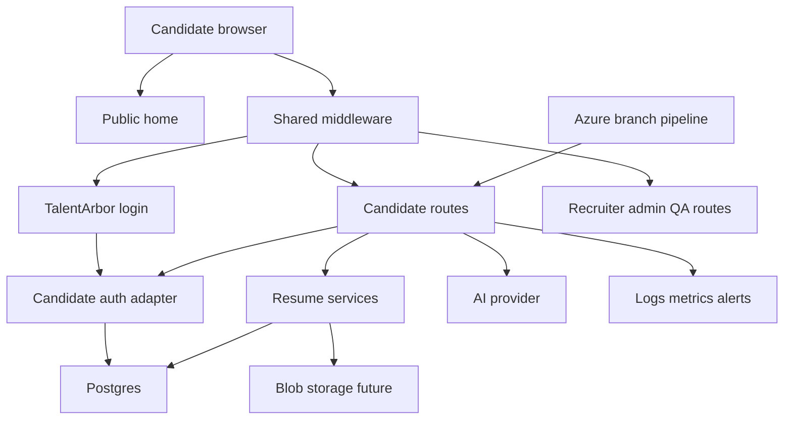

# Candidate App Threat Model

Date: 2026-07-20
Status: Working threat model refreshed through the ratified transcript-first voice boundary

## Purpose

This document identifies the current security and privacy risks for the candidate Interview Coach app as it is being integrated into the shared recruiter Postgres repo.

It should be updated whenever auth, persistence, uploads, AI services, UI exposure, or deployment boundaries change.

Product/legal policy posture, app-local notices, consent moments, and retention requirements live in [Privacy, Disclosures, And Consent Requirements](privacy-disclosures-and-consent-requirements.md). This threat model should reference that artifact instead of duplicating disclosure copy or detailed retention policy.

## Scope And Assumptions

In scope:

- public and protected candidate routes on `interviewcoach.talentarbor.com`
- shared host route partitioning between candidate, recruiter, admin, QA, and invite-token paths
- candidate auth handoff, local dev auth, and mock auth controls
- candidate Postgres profile, draft, session, dashboard, and resume-context data
- resume paste, file-upload metadata, parser-agnostic extraction, and processed artifact retention
- candidate mutation rate limits, route metrics, structured logs, and seeded smoke paths
- planned candidate-led and invited browser audio capture, provider transcription, recoverable transcript drafts, and immutable voice answers
- Azure branch, PR, pipeline, and deployment-readiness controls that affect candidate integration safety

Out of scope for this pass:

- final TalentArbor/RangamWorks SSO implementation, because the callback/assertion protocol is still open
- final Azure Blob Storage account/container policy, malware scanning, and OCR/photo capture implementation
- polished candidate UI, which has not been built yet beyond route-level and feature-slice surfaces
- full enterprise incident management

Assumptions that materially affect risk:

- Production candidate auth mode is `external`; `dev`, `password`, and `mock` are local/test conveniences only.
- `interviewcoach.talentarbor.com` remains one deployable Next app rather than independently deployed candidate/recruiter apps behind a proxy.
- Candidate data is sensitive PII and interview-preparation content, but final legal/compliance retention requirements are not yet confirmed.
- Pasted/trusted-host text now uses a no-original processed-artifact boundary. Binary upload/photo extraction, malware scanning, and any temporary-storage controls still need platform decisions and evidence.
- AI prompt/response artifact retention is not approved for broad logging or diagnostics.

Open questions:

- What exact protocol will TalentArbor/RangamWorks use to hand identity to Interview Coach after login?
- Does `LoginWithType/2` support a return URL, callback URL, or signed state parameter?
- Which Azure storage account/container naming convention, retention policy, and malware scanning path will production use?
- What AI providers and diagnostic retention rules are approved for resume and interview content?

## System Model

### Primary Components

- Shared Next.js App Router application serving public, candidate, recruiter, admin, QA, and invite-token routes.
- Shared middleware that separates candidate protected route handling from recruiter/admin/QA app auth.
- Candidate auth adapters that normalize external, seeded local dev, password-backed dev, and mock identities into provider-neutral candidate profile resolution input.
- Postgres repositories for candidate profiles, identities, practice drafts, sessions, dashboard read models, and resume context.
- Resume normalization and extraction services that turn paste/upload inputs into normalized processed text or safe failure codes.
- AI-backed session/question/coaching services reused through candidate-owned services and server actions.
- A future provider-neutral transcription service with separate candidate-led and invited ownership adapters; raw audio is transient request material and is not application-persisted.
- Metrics, structured logging, alerts, seeded DB smoke checks, and candidate browser smoke checks.
- Azure branch/PR/pipeline controls for integrating candidate work into the shared Interview Coach repo.

### Data Flows And Trust Boundaries

- Browser -> public `/`: public marketing/funnel request over HTTPS. No candidate-private data should load here.
- Browser -> candidate protected routes: route path enters middleware. External mode redirects to `/auth/talentarbor/start`; local `dev`, `password`, and `mock` modes are allowed only outside production.
- Public CTA -> `/auth/talentarbor/start` -> TalentArbor login: allowlisted `next` path is stored in an HTTP-only, same-site cookie before redirecting to `https://talentarbor.com/Auth/LoginWithType/2`.
- TalentArbor/RangamWorks -> callback or launch handoff: identity assertion details are still unconfirmed. The app expects a normalized issuer, subject, email, display name, workspace, and provider before profile resolution.
- Candidate route/server action -> candidate profile repository -> Postgres: feature code resolves `candidate_profile_id` and queries candidate-owned rows using profile-scoped predicates.
- Practice setup/resume input -> processor -> Postgres: pasted/trusted-host source text and uploaded PDF/DOCX bytes are request-only; only candidate-reviewed processed text, safe label, hashes, bounded redaction counts, and exact policy provenance enter `candidate_resume_processed_artifacts`. Accepted text is then snapshotted into setup/session context.
- Candidate file upload/photo -> extraction/OCR: PDF/DOCX extraction is request-scoped and in-memory with disposal before persistence; photo OCR remains unwired. Any future temporary object storage requires an explicit private hard-TTL and disposal contract rather than candidate-visible paths.
- Candidate session services -> AI provider: role, JD, resume context, answers, and coaching prompts cross to AI services. Candidate input must be treated as untrusted prompt content.
- Browser voice capture -> audience-owned transcription route -> approved transcription provider -> recoverable transcript draft: the route proves owner/session/slot, validates bounded media, and never sends raw audio to the evaluator.
- Runtime -> logs/metrics/alerts: candidate routes, auth denials, rate limits, AI errors, and smoke signals should emit safe operational data only.
- Developer/Azure pipeline -> build/test/deploy branch: CI validates lint, typecheck, tests, build, and smoke readiness before candidate integration is reviewed.

### Diagram

## Assets

- Candidate identity and email: ties practice data to a real person and drives account ownership.
- External identity assertions and auth session state: compromise can become account takeover or cross-account access.
- Candidate drafts, sessions, answers, coaching, summaries, and dashboard history: private interview-preparation content.
- Transient raw voice recordings, candidate-authorized transcripts, and transcription provenance: highly sensitive practice content even when the raw audio is not retained.
- Resume text, uploaded file metadata, future blobs/photos, and extracted artifacts: high-sensitivity employment and personal history data.
- AI prompts and responses: may contain resume text, job details, candidate answers, and coaching feedback.
- Postgres credentials and schema state: controls all durable app data.
- Logs, metrics, alerts, and smoke artifacts: operationally useful but must not become a secondary data leak.
- Build pipeline, PR branch, and deployment settings: integrity controls for shared-host production exposure.

## Evidence Anchors

- Shared host route ownership is documented in [shared-host-routing-contract.md](../04-architecture/shared-host-routing-contract.md).
- Candidate protected-route middleware lives in [middleware.ts](/c:/tmp/Interview-Coach-Recruiter-postgres/src/lib/server/auth/middleware.ts).
- Candidate login allowlisting lives in [candidate-login-intent.ts](/c:/tmp/Interview-Coach-Recruiter-postgres/src/lib/server/candidate-login-intent.ts), [start route](/c:/tmp/Interview-Coach-Recruiter-postgres/src/app/auth/talentarbor/start/route.ts), and [callback route](/c:/tmp/Interview-Coach-Recruiter-postgres/src/app/auth/callback/route.ts).
- Production auth-mode guardrails live in [candidate-runtime-config.ts](/c:/tmp/Interview-Coach-Recruiter-postgres/src/lib/server/candidate/candidate-runtime-config.ts).
- Candidate identity normalization lives in [candidate-auth-adapter.ts](/c:/tmp/Interview-Coach-Recruiter-postgres/src/lib/server/candidate/candidate-auth-adapter.ts).
- Candidate profile and identity persistence live in [candidate-profile-repository.ts](/c:/tmp/Interview-Coach-Recruiter-postgres/src/lib/server/candidate/candidate-profile-repository.ts) and [002_candidate_identity_schema.sql](/c:/tmp/Interview-Coach-Recruiter-postgres/db/migrations/002_candidate_identity_schema.sql).
- Candidate setup draft minimization lives in [candidate-setup-draft-store.ts](/c:/tmp/Interview-Coach-Recruiter-postgres/src/features/candidate-setup-v2/candidate-setup-draft-store.ts).
- Processed artifact ownership and immutable review provenance live in [candidate-resume-text-artifact-repository.ts](/c:/tmp/Interview-Coach-Recruiter-postgres/src/features/candidate-setup-v2/candidate-resume-text-artifact-repository.ts) and migrations [032](/c:/tmp/Interview-Coach-Recruiter-postgres/db/migrations/032_candidate_resume_processed_artifacts.sql) through [033](/c:/tmp/Interview-Coach-Recruiter-postgres/db/migrations/033_candidate_resume_document_upload.sql).
- Resume text privacy processing and PDF/DOCX extraction live in [candidate-resume-text-processing.ts](/c:/tmp/Interview-Coach-Recruiter-postgres/src/features/candidate-setup-v2/candidate-resume-text-processing.ts) and [candidate-resume-document-processing.ts](/c:/tmp/Interview-Coach-Recruiter-postgres/src/features/candidate-setup-v2/candidate-resume-document-processing.ts).
- Candidate mutation rate limits live in [candidate-mutation-boundary.ts](/c:/tmp/Interview-Coach-Recruiter-postgres/src/lib/server/candidate/candidate-mutation-boundary.ts).
- Candidate observability guidance lives in [candidate-observability-plan.md](../07-ops/candidate-observability-plan.md).
- Privacy, disclosure, consent, and retention requirements live in [privacy-disclosures-and-consent-requirements.md](privacy-disclosures-and-consent-requirements.md).
- Voice capture, transcription, answer lineage, and recovery invariants live in [voice-answer-transcription-contract.md](../04-architecture/voice-answer-transcription-contract.md).
- Candidate CI is defined in [azure-pipelines.candidate.yml](/c:/tmp/Interview-Coach-Recruiter-postgres/azure-pipelines.candidate.yml).

## Attacker Model

Realistic capabilities:

- unauthenticated internet user can load `/`, trigger public CTAs, and attempt unsafe `next` values
- unauthenticated or partially authenticated candidate can attempt protected candidate routes
- authenticated candidate can manipulate route params, draft IDs, session IDs, upload metadata, setup text, JD text, resume text, and answers
- recruiter/admin/QA user can use their own app routes but should not gain candidate dashboard/session access through route confusion
- malicious document content can be supplied through future upload extraction or OCR flows
- developer or misconfigured environment can accidentally enable local auth modes outside intended environments

Non-capabilities:

- attacker is not assumed to have Azure project admin rights, production DB credentials, or TalentArbor identity-provider signing keys
- attacker is not assumed to control trusted server environment variables
- attacker is not assumed to access private blob storage directly unless storage policy is misconfigured

## Priority Threats

### T1. Cross-Candidate Data Access

Abuse path:

An authenticated candidate guesses or obtains another candidate's draft/session/summary ID, then calls a protected route or server action that fails to constrain reads and writes by `candidate_profile_id`.

Risk:

- Likelihood: medium. IDs are not intended to be public, but route params and server actions are attacker-controlled.
- Impact: high. Resume text, answers, coaching, and dashboard history are sensitive.
- Priority: high.

Existing mitigations:

- Candidate repositories use profile-scoped predicates such as `practice_draft_id = $1 and candidate_profile_id = $2`.
- Dashboard loader tests assert profile-scoped queries.
- Candidate route loaders resolve a candidate profile before loading private data.

Gaps and follow-ups:

- Continue adding negative ownership tests whenever new candidate routes/actions are introduced.
- Verify final external SSO callback cannot resolve the wrong candidate profile for a provider subject.

### T2. Open Redirect Or Login Intent Tampering

Abuse path:

An attacker crafts a candidate CTA/login URL with an external or malformed `next` value to redirect a candidate to an attacker-controlled site after login or to confuse candidate/recruiter route ownership.

Risk:

- Likelihood: medium. Public login-start URLs are attacker-reachable.
- Impact: medium to high. Open redirects can support phishing and session-handoff confusion.
- Priority: high until final TalentArbor return behavior is confirmed.

Existing mitigations:

- `resolveCandidateLoginNext` allows only selected internal candidate paths and rejects protocol-relative paths, backslashes, query strings, fragments, and unsupported routes.
- `/auth/talentarbor/start` stores the sanitized next path in an HTTP-only, same-site cookie.

Gaps and follow-ups:

- Confirm whether TalentArbor supports a signed state or return-url contract.
- Add final callback tests once the real handoff protocol is known.

### T3. Weak Dev Auth Or Mock Mode In Production

Abuse path:

Candidate local dev, password, or mock mode is accidentally enabled in production, allowing non-SSO access to protected candidate data or bypassing expected identity assurance.

Risk:

- Likelihood: low to medium. The code has production guardrails, but deployment config mistakes are realistic.
- Impact: high. Auth bypass can expose candidate data.
- Priority: high.

Existing mitigations:

- `candidate-runtime-config.ts` rejects `dev`, `password`, and `mock` auth modes when production server config is detected.
- Middleware defaults candidate auth mode to `external`.

Gaps and follow-ups:

- Deployment checklist should explicitly verify `CANDIDATE_AUTH_MODE=external`.
- Pipeline or startup smoke should fail if production-like env allows local candidate auth modes.

### T4. Resume Data Leakage Through Storage, Logs, Parser Errors, Or Diagnostics

Abuse path:

A candidate uploads or pastes resume content; raw text, parser errors, storage URLs, or original file locations are persisted into logs, metrics, public metadata, diagnostics, or AI-quality review artifacts.

Risk:

- Likelihood: medium. Resume content touches parsers, Postgres, future blob storage, AI prompts, and support/debug surfaces.
- Impact: high. Resumes contain sensitive employment and personal data.
- Priority: high.

Existing mitigations:

- The current upload/photo controls do not put selected source bytes or paths into the setup payload or browser draft storage.
- Pasted/trusted-host text uses a candidate-owned bounded processor; raw paste is neither browser-draft nor database state, and identity-backed setup reloads only an exact accepted artifact.
- PDF/DOCX upload proves same-origin candidate identity before reading an actually bounded 5 MiB stream, checks actual signature/container structure, bounds PDF pages and DOCX expansion/entries, rejects encrypted/traversal/unsupported containers, zero-fills app-owned buffers, and permits persistence only after disposal succeeds.
- Observability plan forbids raw resume text, raw extracted text, uploaded file contents, and provider auth payloads in ordinary logs.
- The ratified V2 ingestion contract requires one server-owned parse, direct-PII-scrub, normalize, candidate-review, and processed-artifact boundary for paste, documents, photos, and trusted-host text. Direct-PII v5 combines exact authenticated aliases and their bounded name variants with header-only inference for unknown names corroborated by one strong contact signal. An ambiguous first span is removed generically only when another span on that same delimited line is a recognized contact signal; likely role, organization, and section titles remain excluded. Real multiline/bullet-delimited street addresses and header postal codes are removed while coarse city/state may remain.
- The ratified contract excludes raw source paths from durable drafts and requires source disposal on every successful or failed terminal outcome before processing can report success.

Gaps and follow-ups:

- Trusted-host lookup is not wired even though the shared text processor supports its source contract.
- Ordered photo OCR and PDF/DOCX extraction have local automated safe-failure/disposal evidence. Production still lacks approved OCR subprocessor posture, deployed throttling/resource/disposal evidence, representative-device/file evidence, parser isolation, and a malware-control decision.
- If synchronous in-memory processing is insufficient, private encrypted hard-TTL temporary storage and deletion-retry/quarantine controls require implementation and security review.
- AI diagnostic artifact retention and redaction rules remain open.

### T5. Prompt Injection Through Resume, JD, Or Candidate Answers

Abuse path:

A candidate includes adversarial instructions in resume text, job descriptions, or answers that attempt to override system prompts, leak hidden instructions, or influence generated coaching incorrectly.

Risk:

- Likelihood: medium. Candidate-provided text is intentionally sent into AI-backed flows.
- Impact: medium. Primary harm is integrity of generated practice/coaching output and possible prompt/config leakage if prompts are poorly separated.
- Priority: medium.

Existing mitigations:

- Architecture treats resume/JD/answers as candidate content rather than trusted instructions.
- Ordinary logs should not include prompt/response bodies.

Gaps and follow-ups:

- Add prompt-contract tests for adversarial resume/JD/answer content.
- Keep system/developer instructions separated from candidate-provided text in all generation services.

### T6. Shared Host Route Or Auth Boundary Collision

Abuse path:

Candidate top-level routes, recruiter routes, admin/QA routes, invite-token paths, middleware, cookies, or generic APIs collide under the shared host and cause the wrong auth boundary or data model to handle a request.

Risk:

- Likelihood: medium. The shared host intentionally mixes actor contexts in one Next app.
- Impact: high if route collision crosses actor data boundaries; medium if it only breaks navigation.
- Priority: high.

Existing mitigations:

- Shared host contract reserves `/recruiter/**`, `/admin/**`, `/qa/**`, `/s/[token]`, and candidate top-level route ownership.
- Middleware separates candidate protected prefixes from recruiter/admin/QA protected prefixes.
- Route collision tests cover public, candidate, recruiter, admin, QA, and invite-token contexts.

Gaps and follow-ups:

- New generic `/api/**` routes should be avoided unless ownership resolution is explicit and tested.
- Candidate UI build-out should continue using top-level candidate paths without touching recruiter/admin/QA ownership.

### T7. Upload Or Mutation Abuse Causing Availability Or Cost Impact

Abuse path:

An attacker or overactive client repeatedly triggers practice generation, answer analysis, session progress, uploads, or extraction workflows to exhaust AI budget, parser CPU/memory, DB writes, or future blob storage.

Risk:

- Likelihood: medium. Public and candidate-protected flows can be automated.
- Impact: medium to high depending on AI/provider costs and parser workload.
- Priority: medium.

Existing mitigations:

- Candidate mutation boundary rate-limits practice generation, session progress, answer submit/analyze, and question retry by candidate, operation, and subject.
- Shared API routes already use IP-based rate-limit helpers for several recruiter-era generation endpoints.
- Resume document extraction caps request bytes, PDF pages, DOCX entries and declared expansion, and rejects extreme compression ratios before text extraction.

Gaps and follow-ups:

- Resume document upload still needs per-candidate throttling, parser process isolation or equivalent containment, a malware-scanning decision, and deployed CPU/memory/timeout evidence.
- Candidate-specific AI generation endpoints should retain rate-limit coverage as UI wiring expands.

### T8. Deployment Control Gaps In Shared Production Host

Abuse path:

Candidate changes merge or deploy without sufficient build validation, reviewer visibility, route regression checks, or linked work-item context, causing a production regression in recruiter or candidate routes.

Risk:

- Likelihood: medium while Azure Boards/wiki/pipeline permissions are split between Fu-Lab and the company project.
- Impact: medium to high because recruiter and candidate share one host.
- Priority: medium.

Existing mitigations:

- Candidate CI script and pipeline definition exist.
- Working backlog, PR checklist, Azure operating model, and seeded smoke paths exist.
- Candidate branch targets the shared Azure repo branch.

Gaps and follow-ups:

- Azure pipeline still needs to be wired in the company project.
- Branch policy and reviewer expectations still depend on company project permissions and reviewer availability.

### T9. Voice Audio Leakage, Misattribution, Replay, Or Cost Abuse

Abuse path:

An attacker or broken client uploads oversized or mislabeled media, reuses an operation key with different audio, submits audio against another owner/session/slot, causes duplicate provider calls, or leaks audio/transcript content through logs, diagnostics, QA exports, or provider errors. A coupled implementation could also accept a voice answer before a durable transcript exists or evaluate provider-rewritten wording as the candidate's answer.

Risk:

- Likelihood: medium once recording is exposed because all route, media, and operation fields are attacker-controlled.
- Impact: high because voice and transcript content is sensitive, provider calls incur cost, and misattribution can corrupt immutable answer/evaluator history.
- Priority: high before voice enablement.

Required mitigations:

- Keep recording UI absent unless the exact runtime tuple is available; keep production release blocked until provider-processing approval, deployed-browser evidence, and operational gates pass.
- Require explicit disclosure and user gesture before microphone permission; retain complete text fallback.
- Prove audience owner, session, and question slot before parsing media or calling a provider.
- Enforce code-owned MIME, byte, duration, rate, and request-time limits; use binary/multipart transport rather than base64 JSON.
- Use separate candidate-led and invited transcription persistence with strong foreign keys, hashed idempotency keys, audio fingerprints, leases, immutable terminal states, and exact replay/conflict behavior.
- Never application-persist raw audio or place it in logs, metrics, QA artifacts, support records, URLs, answer history, or evaluator input.
- Persist a recoverable transcript before immutable answer creation; require a same-audience completed source run, nonblank candidate-authorized transcript, and server-resolved quick-submit or review provenance for every voice answer.
- Separate transcription from evaluation and reject transcript rewriting, coaching, scoring, or delivery claims at the transcription boundary.
- Pin and live-validate an approved provider profile; use metadata-only failure codes and telemetry.

Gaps and follow-ups:

- Exact code-owned media limits, provider profile, provider-side audio-retention approval, and credentialed acceptance are implementation and release gates.
- Voice-marker extraction and delivery coaching require a separate evidence, persistence, and privacy contract.

## Minimum Security Requirements

- no Supabase runtime secrets or clients
- no public blob access for candidate files
- no public upload URLs or unsafe storage paths persisted in candidate draft metadata
- no raw parser errors persisted in candidate draft metadata
- no raw session token storage
- no cross-candidate data access
- no production dev, mock, or password candidate auth
- no unvalidated file uploads
- no raw resume text, extracted text, answers, generated coaching, provider auth payloads, or prompt bodies in ordinary logs
- no raw voice audio, transcript text, audio fingerprints, or transcription-provider output in ordinary logs, metrics, or QA artifacts
- no generic shared-host route or API ownership changes without route/auth regression tests
- no candidate UI release claim until candidate-facing UI workflows are actually built and smoke-tested

## Manual Review Focus Paths

- [src/lib/server/auth/middleware.ts](/c:/tmp/Interview-Coach-Recruiter-postgres/src/lib/server/auth/middleware.ts): shared host auth routing and candidate/recruiter boundary split.
- [src/lib/server/candidate-login-intent.ts](/c:/tmp/Interview-Coach-Recruiter-postgres/src/lib/server/candidate-login-intent.ts): candidate return-target allowlist.
- [src/app/auth/talentarbor/start/route.ts](/c:/tmp/Interview-Coach-Recruiter-postgres/src/app/auth/talentarbor/start/route.ts): public login-start cookie and external redirect behavior.
- [src/app/auth/callback/route.ts](/c:/tmp/Interview-Coach-Recruiter-postgres/src/app/auth/callback/route.ts): callback placeholder that must evolve once the identity handoff contract is known.
- [src/lib/server/candidate/candidate-runtime-config.ts](/c:/tmp/Interview-Coach-Recruiter-postgres/src/lib/server/candidate/candidate-runtime-config.ts): production fail-closed auth/data backend controls.
- [src/lib/server/candidate/candidate-auth-adapter.ts](/c:/tmp/Interview-Coach-Recruiter-postgres/src/lib/server/candidate/candidate-auth-adapter.ts): provider-neutral identity normalization.
- [src/lib/server/candidate/candidate-profile-repository.ts](/c:/tmp/Interview-Coach-Recruiter-postgres/src/lib/server/candidate/candidate-profile-repository.ts): candidate profile and external identity persistence.
- [src/features/candidate-setup-v2/candidate-resume-text-artifact-repository.ts](/c:/tmp/Interview-Coach-Recruiter-postgres/src/features/candidate-setup-v2/candidate-resume-text-artifact-repository.ts): candidate ownership, exact-policy artifacts, review fencing, and accepted-artifact resolution.
- [src/features/candidate-setup-v2/candidate-resume-document-processing.ts](/c:/tmp/Interview-Coach-Recruiter-postgres/src/features/candidate-setup-v2/candidate-resume-document-processing.ts): content inspection, extraction bounds, source disposal, and safe failure handling.
- [src/lib/server/candidate/candidate-mutation-boundary.ts](/c:/tmp/Interview-Coach-Recruiter-postgres/src/lib/server/candidate/candidate-mutation-boundary.ts): candidate mutation rate limits and idempotency assumptions.
- [src/features/candidate-session](/c:/tmp/Interview-Coach-Recruiter-postgres/src/features/candidate-session): candidate session actions, answer submission, analysis, retry, and summary flows.
- [src/features/practice-setup](/c:/tmp/Interview-Coach-Recruiter-postgres/src/features/practice-setup): setup validation, draft updates, and future UI wiring.
- [src/features/candidate-dashboard](/c:/tmp/Interview-Coach-Recruiter-postgres/src/features/candidate-dashboard): candidate dashboard read model and next-action surfaces.
- [db/migrations/002_candidate_identity_schema.sql](/c:/tmp/Interview-Coach-Recruiter-postgres/db/migrations/002_candidate_identity_schema.sql): candidate profile and identity constraints.
- [db/migrations/003_candidate_practice_drafts_schema.sql](/c:/tmp/Interview-Coach-Recruiter-postgres/db/migrations/003_candidate_practice_drafts_schema.sql): draft schema, JSON constraints, and indexes.
- [azure-pipelines.candidate.yml](/c:/tmp/Interview-Coach-Recruiter-postgres/azure-pipelines.candidate.yml): CI gate coverage before shared-host integration.

## Quality Check

- Entry points covered: public `/`, candidate protected routes, TalentArbor login start/callback, candidate server actions, resume paste/upload/extraction, AI calls, recruiter/admin/QA shared host routes, invite-token preservation, pipeline/deployment path.
- Trust boundaries covered: browser/app, public/protected, candidate/recruiter/admin/QA, app/Postgres, app/blob storage, app/AI provider, app/TalentArbor, runtime/logs, developer/Azure pipeline.
- Runtime vs CI/dev separated: production auth, local dev auth, mock auth, seeded smoke, and Azure pipeline are called out separately.
- Assumptions and open questions are explicit.
- Current UI status is explicit: candidate UI polish is not complete and should not be represented as production-ready.

## References

- NIST SSDF: https://csrc.nist.gov/pubs/sp/800/218/final
- OWASP ASVS: https://owasp.org/www-project-application-security-verification-standard/
- OWASP Top 10: https://owasp.org/www-project-top-ten/
