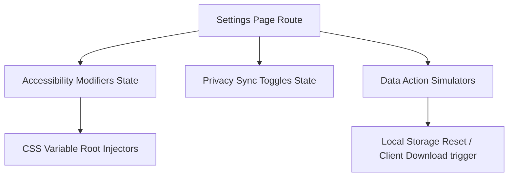

# Specification: Candidate Settings & Admin Surface

This document maps the settings and administrative controls for the standalone, host-platform-integrated Interview Coach module.

---

## 1. Feature Map by Release Posture

### 🟢 Current Release (High Priority)
The following administrative settings are target scope for the initial release and are easily testable.

#### A. Data Privacy & Control (Section 3)
* **Data Portability (Export Prep Data)**:
  * **Description**: Candidates can export all application-governed records (practice logs, transcripts, evaluation results) as a structured JSON file bundle.
  * **Simulated CTA**: "Export All Data (JSON)".
* **Data Deletion Options (GDPR/CCPA Compliance)**:
  * **Option 1: Clear History**: Clears all voice transcripts, audio references, and feedback cards but preserves active role setup profiles.
  * **Option 2: Delete All Data**: Performs a destructive hard wipe of all local databases and deletes all candidate data from the Coach servers.

#### B. Host Platform Integration & Sync (Section 3)
* **Recruiter Sharing Toggle**:
  * **Description**: Opt-in toggle to share performance evaluations. When enabled, the coach pushes "Prepared" badges and strong rating metrics back to the host platform (e.g. TalentArbor) to prioritize matching algorithms.
  * **Default State**: Disabled (Strict Privacy First).

#### C. Workspace Accessibility Modifiers (Section 2)
* **Font Scaling**: Selector to adjust workspace base typography size (`Normal`, `Large`, `Extra Large`) to enhance readability in active transcription views.
* **High Contrast Toggle**: Standard visual accessibility setting mapping directly to the global styling variables.

#### D. AI Coaching Feedback Strictness
* **Description**: Simple, low-friction slider mapping to the feedback evaluation strictness.
* **Dials**:
  * `Encouraging & Constructive` (Focuses on personal strengths, displays top 2 high-impact improvement points).
  * `Balanced` (Default; targets comprehensive STAR alignment).
  * `Direct & Critical` (Strict technical panel style; critiques all missing criteria).

---

### 🟡 Future Enhancements (Deferred)
The following settings are categorized as secondary phase additions and are deferred.

* **Audio Input Calibration**: Custom input channel selector, microphone level testers, and noise-cancellation switches (Deferred to release 2).
* **Practice Time Targets**: Option to configure target answer limits (e.g. *“Limit recordings to 2 minutes”*, *“Untimed”*) (Deferred to release 2).
* **Custom STT Vocabulary**: Training field to supply unique abbreviations and metrics (e.g., specific framework names) to optimize speech-to-text accuracy (Deferred to release 2).

---

## 2. Implementation Plan

### Phase 1: Client State Layout (Immediate)
* Create `src/app/candidate/settings-demo/page.tsx` as a Next.js client component.
* Standardize UI using CSS variable-driven states (`text-lg` and `text-xl` font overrides, high-contrast wrapper states).

### Phase 2: Action Hookups & Simulators
* **Export Action**: Generate a temporary data download link in JavaScript (`URL.createObjectURL` parsing active mock state profiles) to simulate JSON/ZIP download.
* **Wipe Actions**: Trigger explicit state resets, clearing browser state indicators and issuing alert warnings.

### Phase 3: Root Styles Integration (Production Hand-off)
* Integrate settings state variables back into the global React Context (`CandidateSettingsContext`) in the main rebuild branch so that accessibility modifiers dynamically scale text values across the Candidate Dashboard and Active Practice workspace.
